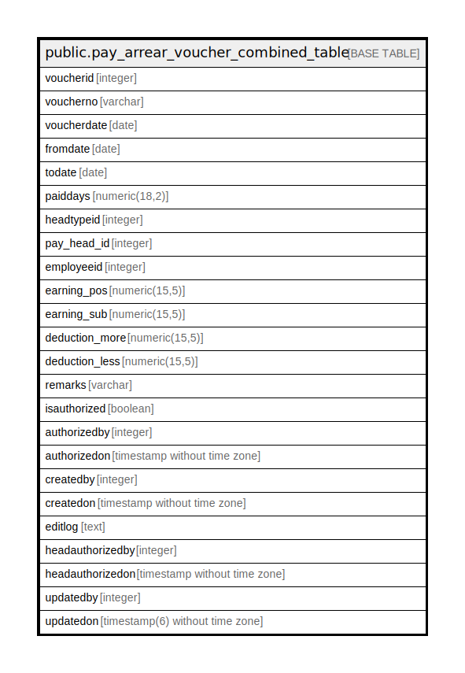

# public.pay_arrear_voucher_combined_table

## Description

## Columns

| Name | Type | Default | Nullable | Children | Parents | Comment |
| ---- | ---- | ------- | -------- | -------- | ------- | ------- |
| voucherid | integer | nextval('pay_arrear_voucher_combined_table_voucherid_seq'::regclass) | false |  |  |  |
| voucherno | varchar |  | false |  |  |  |
| voucherdate | date |  | false |  |  |  |
| fromdate | date |  | false |  |  |  |
| todate | date |  | false |  |  |  |
| paiddays | numeric(18,2) |  | true |  |  |  |
| headtypeid | integer |  | true |  |  |  |
| pay_head_id | integer |  | false |  |  |  |
| employeeid | integer |  | false |  |  |  |
| earning_pos | numeric(15,5) |  | true |  |  |  |
| earning_sub | numeric(15,5) |  | true |  |  |  |
| deduction_more | numeric(15,5) |  | true |  |  |  |
| deduction_less | numeric(15,5) |  | true |  |  |  |
| remarks | varchar |  | true |  |  |  |
| isauthorized | boolean | false | false |  |  |  |
| authorizedby | integer |  | true |  |  |  |
| authorizedon | timestamp without time zone |  | true |  |  |  |
| createdby | integer |  | true |  |  |  |
| createdon | timestamp without time zone | now() | true |  |  |  |
| editlog | text |  | true |  |  |  |
| headauthorizedby | integer |  | true |  |  |  |
| headauthorizedon | timestamp without time zone |  | true |  |  |  |
| updatedby | integer |  | true |  |  |  |
| updatedon | timestamp(6) without time zone | NULL::timestamp without time zone | true |  |  |  |

## Constraints

| Name | Type | Definition |
| ---- | ---- | ---------- |
| pay_arrear_voucher_combined_table_pkey | PRIMARY KEY | PRIMARY KEY (voucherid) |

## Indexes

| Name | Definition |
| ---- | ---------- |
| pay_arrear_voucher_combined_table_pkey | CREATE UNIQUE INDEX pay_arrear_voucher_combined_table_pkey ON public.pay_arrear_voucher_combined_table USING btree (voucherid) |

## Relations

---

> Generated by [tbls](https://github.com/k1LoW/tbls)
