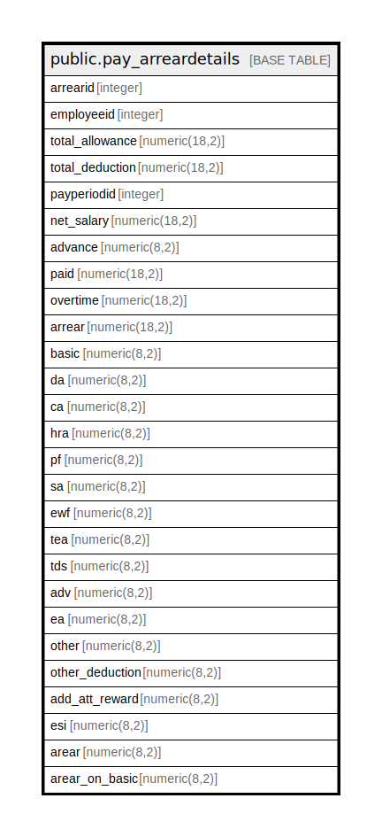

# public.pay_arreardetails

## Description

## Columns

| Name | Type | Default | Nullable | Children | Parents | Comment |
| ---- | ---- | ------- | -------- | -------- | ------- | ------- |
| arrearid | integer | nextval('pay_arreardetails_arrearid_seq'::regclass) | false |  |  |  |
| employeeid | integer |  | true |  |  |  |
| total_allowance | numeric(18,2) |  | true |  |  |  |
| total_deduction | numeric(18,2) |  | true |  |  |  |
| payperiodid | integer |  | true |  |  |  |
| net_salary | numeric(18,2) |  | true |  |  |  |
| advance | numeric(8,2) |  | true |  |  |  |
| paid | numeric(18,2) |  | true |  |  |  |
| overtime | numeric(18,2) |  | true |  |  |  |
| arrear | numeric(18,2) |  | true |  |  |  |
| basic | numeric(8,2) |  | true |  |  |  |
| da | numeric(8,2) |  | true |  |  |  |
| ca | numeric(8,2) |  | true |  |  |  |
| hra | numeric(8,2) |  | true |  |  |  |
| pf | numeric(8,2) |  | true |  |  |  |
| sa | numeric(8,2) |  | true |  |  |  |
| ewf | numeric(8,2) |  | true |  |  |  |
| tea | numeric(8,2) |  | true |  |  |  |
| tds | numeric(8,2) |  | true |  |  |  |
| adv | numeric(8,2) |  | true |  |  |  |
| ea | numeric(8,2) |  | true |  |  |  |
| other | numeric(8,2) |  | true |  |  |  |
| other_deduction | numeric(8,2) |  | true |  |  |  |
| add_att_reward | numeric(8,2) |  | true |  |  |  |
| esi | numeric(8,2) |  | true |  |  |  |
| arear | numeric(8,2) |  | true |  |  |  |
| arear_on_basic | numeric(8,2) |  | true |  |  |  |

## Constraints

| Name | Type | Definition |
| ---- | ---- | ---------- |
| pay_arreardetails_pkey | PRIMARY KEY | PRIMARY KEY (arrearid) |

## Indexes

| Name | Definition |
| ---- | ---------- |
| pay_arreardetails_pkey | CREATE UNIQUE INDEX pay_arreardetails_pkey ON public.pay_arreardetails USING btree (arrearid) |

## Relations

---

> Generated by [tbls](https://github.com/k1LoW/tbls)
