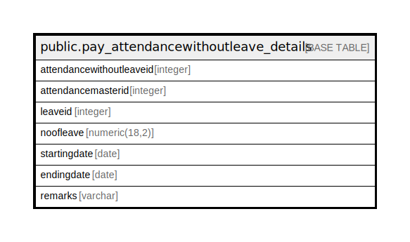

# public.pay_attendancewithoutleave_details

## Description

## Columns

| Name | Type | Default | Nullable | Children | Parents | Comment |
| ---- | ---- | ------- | -------- | -------- | ------- | ------- |
| attendancewithoutleaveid | integer | nextval('pay_attendancewithoutleave_details_attendancewithoutleaveid_seq'::regclass) | false |  |  |  |
| attendancemasterid | integer |  | true |  |  |  |
| leaveid | integer |  | true |  |  |  |
| noofleave | numeric(18,2) |  | true |  |  |  |
| startingdate | date |  | true |  |  |  |
| endingdate | date |  | true |  |  |  |
| remarks | varchar |  | true |  |  |  |

## Constraints

| Name | Type | Definition |
| ---- | ---- | ---------- |
| pay_attendance_without_leave_details_pkey | PRIMARY KEY | PRIMARY KEY (attendancewithoutleaveid) |

## Indexes

| Name | Definition |
| ---- | ---------- |
| pay_attendance_without_leave_details_pkey | CREATE UNIQUE INDEX pay_attendance_without_leave_details_pkey ON public.pay_attendancewithoutleave_details USING btree (attendancewithoutleaveid) |

## Relations

---

> Generated by [tbls](https://github.com/k1LoW/tbls)
