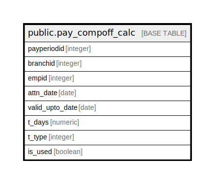

# public.pay_compoff_calc

## Description

## Columns

| Name | Type | Default | Nullable | Children | Parents | Comment |
| ---- | ---- | ------- | -------- | -------- | ------- | ------- |
| payperiodid | integer |  | true |  |  |  |
| branchid | integer |  | true |  |  |  |
| empid | integer |  | true |  |  |  |
| attn_date | date |  | true |  |  |  |
| valid_upto_date | date |  | true |  |  |  |
| t_days | numeric |  | true |  |  |  |
| t_type | integer |  | true |  |  |  |
| is_used | boolean | false | true |  |  |  |

## Relations

---

> Generated by [tbls](https://github.com/k1LoW/tbls)
