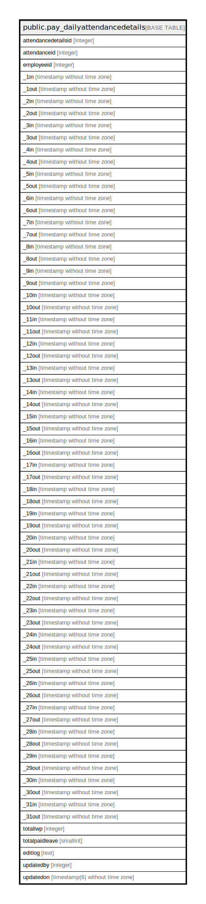

# public.pay_dailyattendancedetails

## Description

## Columns

| Name | Type | Default | Nullable | Children | Parents | Comment |
| ---- | ---- | ------- | -------- | -------- | ------- | ------- |
| attendancedetailsid | integer | nextval('pay_dailyattendancedetails_attendancedetailsid_seq'::regclass) | false |  |  |  |
| attendanceid | integer |  | true |  |  |  |
| employeeid | integer |  | true |  |  |  |
| _1in | timestamp without time zone |  | true |  |  |  |
| _1out | timestamp without time zone |  | true |  |  |  |
| _2in | timestamp without time zone |  | true |  |  |  |
| _2out | timestamp without time zone |  | true |  |  |  |
| _3in | timestamp without time zone |  | true |  |  |  |
| _3out | timestamp without time zone |  | true |  |  |  |
| _4in | timestamp without time zone |  | true |  |  |  |
| _4out | timestamp without time zone |  | true |  |  |  |
| _5in | timestamp without time zone |  | true |  |  |  |
| _5out | timestamp without time zone |  | true |  |  |  |
| _6in | timestamp without time zone |  | true |  |  |  |
| _6out | timestamp without time zone |  | true |  |  |  |
| _7in | timestamp without time zone |  | true |  |  |  |
| _7out | timestamp without time zone |  | true |  |  |  |
| _8in | timestamp without time zone |  | true |  |  |  |
| _8out | timestamp without time zone |  | true |  |  |  |
| _9in | timestamp without time zone |  | true |  |  |  |
| _9out | timestamp without time zone |  | true |  |  |  |
| _10in | timestamp without time zone |  | true |  |  |  |
| _10out | timestamp without time zone |  | true |  |  |  |
| _11in | timestamp without time zone |  | true |  |  |  |
| _11out | timestamp without time zone |  | true |  |  |  |
| _12in | timestamp without time zone |  | true |  |  |  |
| _12out | timestamp without time zone |  | true |  |  |  |
| _13in | timestamp without time zone |  | true |  |  |  |
| _13out | timestamp without time zone |  | true |  |  |  |
| _14in | timestamp without time zone |  | true |  |  |  |
| _14out | timestamp without time zone |  | true |  |  |  |
| _15in | timestamp without time zone |  | true |  |  |  |
| _15out | timestamp without time zone |  | true |  |  |  |
| _16in | timestamp without time zone |  | true |  |  |  |
| _16out | timestamp without time zone |  | true |  |  |  |
| _17in | timestamp without time zone |  | true |  |  |  |
| _17out | timestamp without time zone |  | true |  |  |  |
| _18in | timestamp without time zone |  | true |  |  |  |
| _18out | timestamp without time zone |  | true |  |  |  |
| _19in | timestamp without time zone |  | true |  |  |  |
| _19out | timestamp without time zone |  | true |  |  |  |
| _20in | timestamp without time zone |  | true |  |  |  |
| _20out | timestamp without time zone |  | true |  |  |  |
| _21in | timestamp without time zone |  | true |  |  |  |
| _21out | timestamp without time zone |  | true |  |  |  |
| _22in | timestamp without time zone |  | true |  |  |  |
| _22out | timestamp without time zone |  | true |  |  |  |
| _23in | timestamp without time zone |  | true |  |  |  |
| _23out | timestamp without time zone |  | true |  |  |  |
| _24in | timestamp without time zone |  | true |  |  |  |
| _24out | timestamp without time zone |  | true |  |  |  |
| _25in | timestamp without time zone |  | true |  |  |  |
| _25out | timestamp without time zone |  | true |  |  |  |
| _26in | timestamp without time zone |  | true |  |  |  |
| _26out | timestamp without time zone |  | true |  |  |  |
| _27in | timestamp without time zone |  | true |  |  |  |
| _27out | timestamp without time zone |  | true |  |  |  |
| _28in | timestamp without time zone |  | true |  |  |  |
| _28out | timestamp without time zone |  | true |  |  |  |
| _29in | timestamp without time zone |  | true |  |  |  |
| _29out | timestamp without time zone |  | true |  |  |  |
| _30in | timestamp without time zone |  | true |  |  |  |
| _30out | timestamp without time zone |  | true |  |  |  |
| _31in | timestamp without time zone |  | true |  |  |  |
| _31out | timestamp without time zone |  | true |  |  |  |
| totallwp | integer |  | true |  |  |  |
| totalpaidleave | smallint |  | true |  |  |  |
| editlog | text |  | true |  |  |  |
| updatedby | integer |  | true |  |  |  |
| updatedon | timestamp(6) without time zone | NULL::timestamp without time zone | true |  |  |  |

## Constraints

| Name | Type | Definition |
| ---- | ---- | ---------- |
| pay_dailyattendancedetails_pkey1 | PRIMARY KEY | PRIMARY KEY (attendancedetailsid) |

## Indexes

| Name | Definition |
| ---- | ---------- |
| pay_dailyattendancedetails_pkey1 | CREATE UNIQUE INDEX pay_dailyattendancedetails_pkey1 ON public.pay_dailyattendancedetails USING btree (attendancedetailsid) |

## Relations

---

> Generated by [tbls](https://github.com/k1LoW/tbls)
