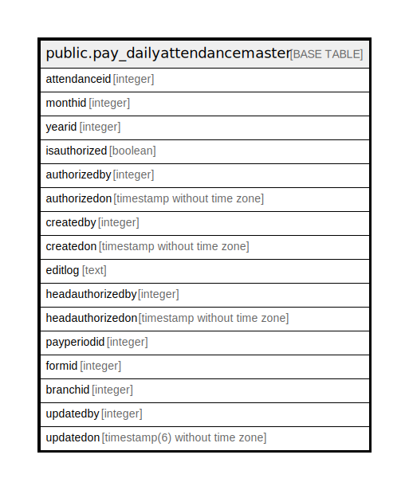

# public.pay_dailyattendancemaster

## Description

## Columns

| Name | Type | Default | Nullable | Children | Parents | Comment |
| ---- | ---- | ------- | -------- | -------- | ------- | ------- |
| attendanceid | integer | nextval('pay_dailyattendancemaster_attendanceid_seq'::regclass) | false |  |  |  |
| monthid | integer |  | false |  |  |  |
| yearid | integer |  | true |  |  |  |
| isauthorized | boolean |  | true |  |  |  |
| authorizedby | integer |  | true |  |  |  |
| authorizedon | timestamp without time zone |  | true |  |  |  |
| createdby | integer |  | true |  |  |  |
| createdon | timestamp without time zone | now() | true |  |  |  |
| editlog | text |  | true |  |  |  |
| headauthorizedby | integer |  | true |  |  |  |
| headauthorizedon | timestamp without time zone |  | true |  |  |  |
| payperiodid | integer |  | true |  |  |  |
| formid | integer |  | true |  |  |  |
| branchid | integer |  | true |  |  |  |
| updatedby | integer |  | true |  |  |  |
| updatedon | timestamp(6) without time zone | NULL::timestamp without time zone | true |  |  |  |

## Constraints

| Name | Type | Definition |
| ---- | ---- | ---------- |
| pay_dailyattendancemaster_pkey | PRIMARY KEY | PRIMARY KEY (attendanceid) |

## Indexes

| Name | Definition |
| ---- | ---------- |
| pay_dailyattendancemaster_pkey | CREATE UNIQUE INDEX pay_dailyattendancemaster_pkey ON public.pay_dailyattendancemaster USING btree (attendanceid) |

## Relations

---

> Generated by [tbls](https://github.com/k1LoW/tbls)
