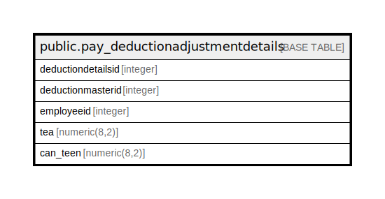

# public.pay_deductionadjustmentdetails

## Description

## Columns

| Name | Type | Default | Nullable | Children | Parents | Comment |
| ---- | ---- | ------- | -------- | -------- | ------- | ------- |
| deductiondetailsid | integer | nextval('pay_deductionadjustmentdetails_deductiondetailsid_seq'::regclass) | false |  |  |  |
| deductionmasterid | integer |  | true |  |  |  |
| employeeid | integer |  | true |  |  |  |

## Constraints

| Name | Type | Definition |
| ---- | ---- | ---------- |
| pay_deductionadjustmentdetails_pkey | PRIMARY KEY | PRIMARY KEY (deductiondetailsid) |

## Indexes

| Name | Definition |
| ---- | ---------- |
| pay_deductionadjustmentdetails_pkey | CREATE UNIQUE INDEX pay_deductionadjustmentdetails_pkey ON public.pay_deductionadjustmentdetails USING btree (deductiondetailsid) |

## Relations

---

> Generated by [tbls](https://github.com/k1LoW/tbls)
