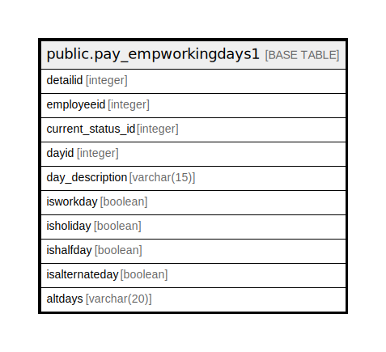

# public.pay_empworkingdays1

## Description

## Columns

| Name | Type | Default | Nullable | Children | Parents | Comment |
| ---- | ---- | ------- | -------- | -------- | ------- | ------- |
| detailid | integer |  | true |  |  |  |
| employeeid | integer |  | true |  |  |  |
| current_status_id | integer |  | true |  |  |  |
| dayid | integer |  | true |  |  |  |
| day_description | varchar(15) |  | true |  |  |  |
| isworkday | boolean |  | true |  |  |  |
| isholiday | boolean |  | true |  |  |  |
| ishalfday | boolean |  | true |  |  |  |
| isalternateday | boolean |  | true |  |  |  |
| altdays | varchar(20) |  | true |  |  |  |

## Relations

---

> Generated by [tbls](https://github.com/k1LoW/tbls)
