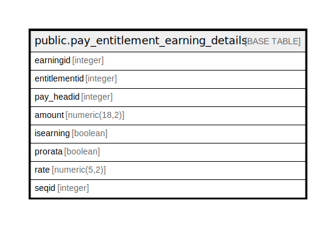

# public.pay_entitlement_earning_details

## Description

## Columns

| Name | Type | Default | Nullable | Children | Parents | Comment |
| ---- | ---- | ------- | -------- | -------- | ------- | ------- |
| earningid | integer | nextval('pay_entitlement_earning_details_earningid_seq'::regclass) | false |  |  |  |
| entitlementid | integer |  | true |  |  |  |
| pay_headid | integer |  | true |  |  |  |
| amount | numeric(18,2) |  | true |  |  |  |
| isearning | boolean |  | true |  |  |  |
| prorata | boolean |  | true |  |  |  |
| rate | numeric(5,2) |  | true |  |  |  |
| seqid | integer |  | true |  |  |  |

## Constraints

| Name | Type | Definition |
| ---- | ---- | ---------- |
| pay_entitlement_earning_details_pkey | PRIMARY KEY | PRIMARY KEY (earningid) |

## Indexes

| Name | Definition |
| ---- | ---------- |
| pay_entitlement_earning_details_pkey | CREATE UNIQUE INDEX pay_entitlement_earning_details_pkey ON public.pay_entitlement_earning_details USING btree (earningid) |

## Relations

---

> Generated by [tbls](https://github.com/k1LoW/tbls)
