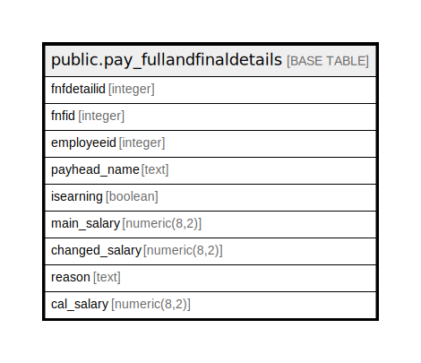

# public.pay_fullandfinaldetails

## Description

## Columns

| Name | Type | Default | Nullable | Children | Parents | Comment |
| ---- | ---- | ------- | -------- | -------- | ------- | ------- |
| fnfdetailid | integer | nextval('pay_fullandfinaldetails_fnfdetailid_seq'::regclass) | false |  |  |  |
| fnfid | integer |  | true |  |  |  |
| employeeid | integer |  | true |  |  |  |
| payhead_name | text |  | true |  |  |  |
| isearning | boolean |  | true |  |  |  |
| main_salary | numeric(8,2) |  | true |  |  |  |
| changed_salary | numeric(8,2) |  | true |  |  |  |
| reason | text |  | true |  |  |  |
| cal_salary | numeric(8,2) |  | true |  |  |  |

## Relations

---

> Generated by [tbls](https://github.com/k1LoW/tbls)
