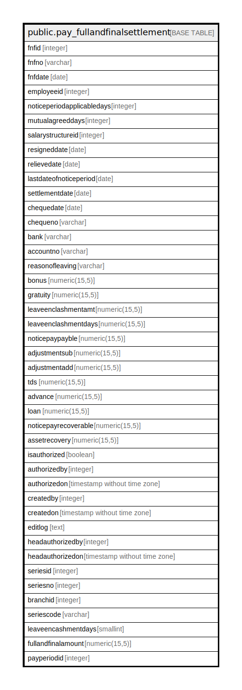

# public.pay_fullandfinalsettlement

## Description

## Columns

| Name | Type | Default | Nullable | Children | Parents | Comment |
| ---- | ---- | ------- | -------- | -------- | ------- | ------- |
| fnfid | integer | nextval('pay_fullandfinalsettlement_fnfid_seq'::regclass) | false |  |  |  |
| fnfno | varchar |  | true |  |  |  |
| fnfdate | date |  | true |  |  |  |
| employeeid | integer |  | true |  |  |  |
| noticeperiodapplicabledays | integer |  | true |  |  |  |
| mutualagreeddays | integer |  | true |  |  |  |
| salarystructureid | integer |  | true |  |  |  |
| resigneddate | date |  | true |  |  |  |
| relievedate | date |  | true |  |  |  |
| lastdateofnoticeperiod | date |  | true |  |  |  |
| settlementdate | date |  | true |  |  |  |
| chequedate | date |  | true |  |  |  |
| chequeno | varchar |  | true |  |  |  |
| bank | varchar |  | true |  |  |  |
| accountno | varchar |  | true |  |  |  |
| reasonofleaving | varchar |  | true |  |  |  |
| bonus | numeric(15,5) |  | true |  |  |  |
| gratuity | numeric(15,5) |  | true |  |  |  |
| leaveenclashmentamt | numeric(15,5) |  | true |  |  |  |
| leaveenclashmentdays | numeric(15,5) |  | true |  |  |  |
| noticepaypayble | numeric(15,5) |  | true |  |  |  |
| adjustmentsub | numeric(15,5) |  | true |  |  |  |
| adjustmentadd | numeric(15,5) |  | true |  |  |  |
| tds | numeric(15,5) |  | true |  |  |  |
| advance | numeric(15,5) |  | true |  |  |  |
| loan | numeric(15,5) |  | true |  |  |  |
| noticepayrecoverable | numeric(15,5) |  | true |  |  |  |
| assetrecovery | numeric(15,5) |  | true |  |  |  |
| isauthorized | boolean |  | true |  |  |  |
| authorizedby | integer |  | true |  |  |  |
| authorizedon | timestamp without time zone |  | true |  |  |  |
| createdby | integer |  | true |  |  |  |
| createdon | timestamp without time zone | now() | true |  |  |  |
| editlog | text |  | true |  |  |  |
| headauthorizedby | integer |  | true |  |  |  |
| headauthorizedon | timestamp without time zone |  | true |  |  |  |
| seriesid | integer |  | true |  |  |  |
| seriesno | integer |  | true |  |  |  |
| branchid | integer |  | true |  |  |  |
| seriescode | varchar |  | true |  |  |  |
| leaveencashmentdays | smallint |  | true |  |  |  |
| fullandfinalamount | numeric(15,5) |  | true |  |  |  |
| payperiodid | integer |  | true |  |  |  |

## Constraints

| Name | Type | Definition |
| ---- | ---- | ---------- |
| pay_fullandfinalsettlement_pkey | PRIMARY KEY | PRIMARY KEY (fnfid) |

## Indexes

| Name | Definition |
| ---- | ---------- |
| pay_fullandfinalsettlement_pkey | CREATE UNIQUE INDEX pay_fullandfinalsettlement_pkey ON public.pay_fullandfinalsettlement USING btree (fnfid) |

## Relations

---

> Generated by [tbls](https://github.com/k1LoW/tbls)
