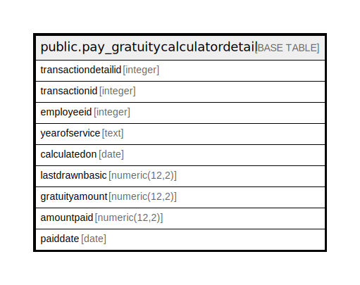

# public.pay_gratuitycalculatordetail

## Description

## Columns

| Name | Type | Default | Nullable | Children | Parents | Comment |
| ---- | ---- | ------- | -------- | -------- | ------- | ------- |
| transactiondetailid | integer | nextval('pay_gratuitycalculatordetail_transactiondetailid_seq'::regclass) | false |  |  |  |
| transactionid | integer |  | true |  |  |  |
| employeeid | integer |  | true |  |  |  |
| yearofservice | text |  | true |  |  |  |
| calculatedon | date |  | true |  |  |  |
| lastdrawnbasic | numeric(12,2) |  | true |  |  |  |
| gratuityamount | numeric(12,2) |  | true |  |  |  |
| amountpaid | numeric(12,2) |  | true |  |  |  |
| paiddate | date |  | true |  |  |  |

## Relations

---

> Generated by [tbls](https://github.com/k1LoW/tbls)
