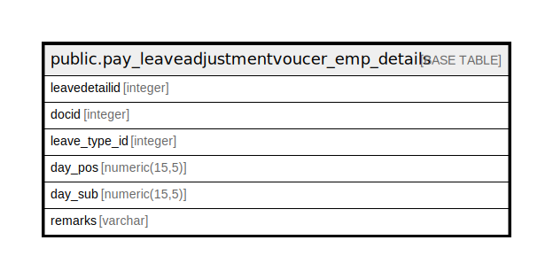

# public.pay_leaveadjustmentvoucer_emp_details

## Description

## Columns

| Name | Type | Default | Nullable | Children | Parents | Comment |
| ---- | ---- | ------- | -------- | -------- | ------- | ------- |
| leavedetailid | integer | nextval('pay_leaveadjustmentvoucer_emp_details_leavedetailid_seq'::regclass) | false |  |  |  |
| docid | integer |  | false |  |  |  |
| leave_type_id | integer |  | false |  |  |  |
| day_pos | numeric(15,5) |  | true |  |  |  |
| day_sub | numeric(15,5) |  | true |  |  |  |
| remarks | varchar |  | true |  |  |  |

## Constraints

| Name | Type | Definition |
| ---- | ---- | ---------- |
| pay_leaveadjustmentvoucer_emp_details_pkey | PRIMARY KEY | PRIMARY KEY (leavedetailid) |

## Indexes

| Name | Definition |
| ---- | ---------- |
| pay_leaveadjustmentvoucer_emp_details_pkey | CREATE UNIQUE INDEX pay_leaveadjustmentvoucer_emp_details_pkey ON public.pay_leaveadjustmentvoucer_emp_details USING btree (leavedetailid) |

## Relations

---

> Generated by [tbls](https://github.com/k1LoW/tbls)
