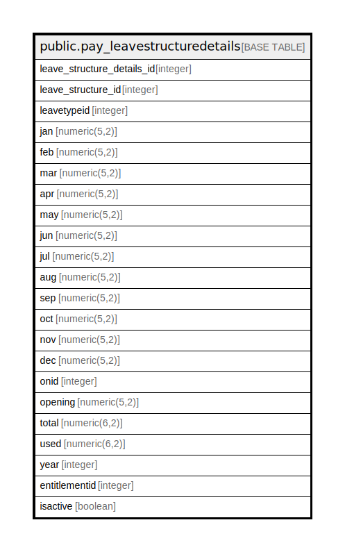

# public.pay_leavestructuredetails

## Description

## Columns

| Name | Type | Default | Nullable | Children | Parents | Comment |
| ---- | ---- | ------- | -------- | -------- | ------- | ------- |
| leave_structure_details_id | integer | nextval('pay_leavestructuredetails_leave_structure_details_id_seq'::regclass) | false |  |  |  |
| leave_structure_id | integer |  | true |  |  |  |
| leavetypeid | integer |  | true |  |  |  |
| jan | numeric(5,2) |  | true |  |  |  |
| feb | numeric(5,2) |  | true |  |  |  |
| mar | numeric(5,2) |  | true |  |  |  |
| apr | numeric(5,2) |  | true |  |  |  |
| may | numeric(5,2) |  | true |  |  |  |
| jun | numeric(5,2) |  | true |  |  |  |
| jul | numeric(5,2) |  | true |  |  |  |
| aug | numeric(5,2) |  | true |  |  |  |
| sep | numeric(5,2) |  | true |  |  |  |
| oct | numeric(5,2) |  | true |  |  |  |
| nov | numeric(5,2) |  | true |  |  |  |
| dec | numeric(5,2) |  | true |  |  |  |
| onid | integer |  | true |  |  |  |
| opening | numeric(5,2) |  | true |  |  |  |
| total | numeric(6,2) |  | true |  |  |  |
| used | numeric(6,2) |  | true |  |  |  |
| year | integer |  | true |  |  |  |
| entitlementid | integer |  | true |  |  |  |
| isactive | boolean |  | true |  |  |  |

## Constraints

| Name | Type | Definition |
| ---- | ---- | ---------- |
| pay_leavestructuredetails_pkey | PRIMARY KEY | PRIMARY KEY (leave_structure_details_id) |
| unique_leave_onid_year | UNIQUE | UNIQUE (leavetypeid, onid, year) |

## Indexes

| Name | Definition |
| ---- | ---------- |
| pay_leavestructuredetails_pkey | CREATE UNIQUE INDEX pay_leavestructuredetails_pkey ON public.pay_leavestructuredetails USING btree (leave_structure_details_id) |
| unique_leave_onid_year | CREATE UNIQUE INDEX unique_leave_onid_year ON public.pay_leavestructuredetails USING btree (leavetypeid, onid, year) |

## Relations

---

> Generated by [tbls](https://github.com/k1LoW/tbls)
