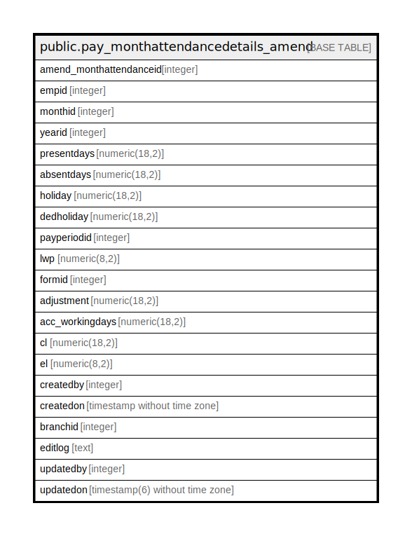

# public.pay_monthattendancedetails_amend

## Description

## Columns

| Name | Type | Default | Nullable | Children | Parents | Comment |
| ---- | ---- | ------- | -------- | -------- | ------- | ------- |
| amend_monthattendanceid | integer | nextval('pay_monthattendancedetails_amend_amend_monthattendanceid_seq'::regclass) | false |  |  |  |
| empid | integer |  | true |  |  |  |
| monthid | integer |  | true |  |  |  |
| yearid | integer |  | true |  |  |  |
| presentdays | numeric(18,2) | NULL::numeric | true |  |  |  |
| absentdays | numeric(18,2) | NULL::numeric | true |  |  |  |
| holiday | numeric(18,2) | NULL::numeric | true |  |  |  |
| dedholiday | numeric(18,2) | NULL::numeric | true |  |  |  |
| payperiodid | integer |  | true |  |  |  |
| lwp | numeric(8,2) | NULL::numeric | true |  |  |  |
| formid | integer |  | true |  |  |  |
| adjustment | numeric(18,2) | NULL::numeric | true |  |  |  |
| acc_workingdays | numeric(18,2) | NULL::numeric | true |  |  |  |
| cl | numeric(18,2) | NULL::numeric | true |  |  |  |
| el | numeric(8,2) | NULL::numeric | true |  |  |  |
| createdby | integer |  | true |  |  |  |
| createdon | timestamp without time zone | now() | true |  |  |  |
| sl | numeric(8,2) |  | true |  |  |  |
| branchid | integer |  | true |  |  |  |
| editlog | text |  | true |  |  |  |
| updatedby | integer |  | true |  |  |  |
| updatedon | timestamp(6) without time zone | NULL::timestamp without time zone | true |  |  |  |

## Constraints

| Name | Type | Definition |
| ---- | ---- | ---------- |
| pay_monthattendancedetails_amend_pkey | PRIMARY KEY | PRIMARY KEY (amend_monthattendanceid) |

## Indexes

| Name | Definition |
| ---- | ---------- |
| pay_monthattendancedetails_amend_pkey | CREATE UNIQUE INDEX pay_monthattendancedetails_amend_pkey ON public.pay_monthattendancedetails_amend USING btree (amend_monthattendanceid) |

## Relations

---

> Generated by [tbls](https://github.com/k1LoW/tbls)
