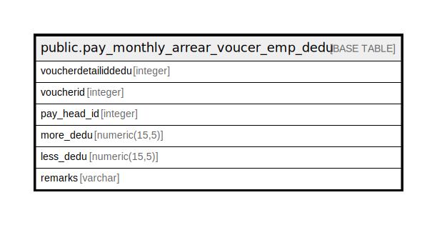

# public.pay_monthly_arrear_voucer_emp_dedu

## Description

## Columns

| Name | Type | Default | Nullable | Children | Parents | Comment |
| ---- | ---- | ------- | -------- | -------- | ------- | ------- |
| voucherdetailiddedu | integer | nextval('pay_monthly_arrear_voucer_emp_dedu_voucherdetailiddedu_seq'::regclass) | false |  |  |  |
| voucherid | integer |  | false |  |  |  |
| pay_head_id | integer |  | false |  |  |  |
| more_dedu | numeric(15,5) |  | true |  |  |  |
| less_dedu | numeric(15,5) |  | true |  |  |  |
| remarks | varchar |  | true |  |  |  |

## Relations

---

> Generated by [tbls](https://github.com/k1LoW/tbls)
