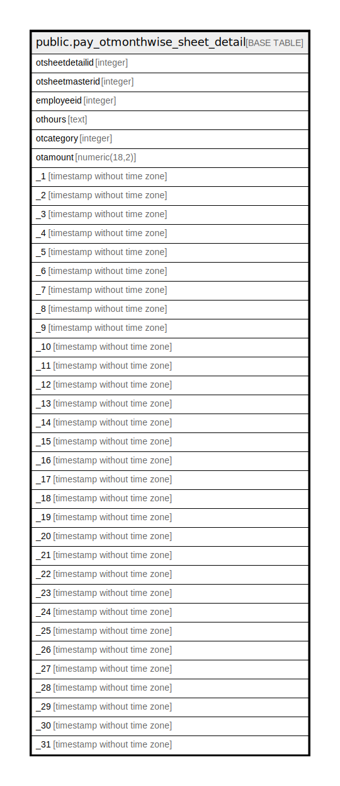

# public.pay_otmonthwise_sheet_detail

## Description

## Columns

| Name | Type | Default | Nullable | Children | Parents | Comment |
| ---- | ---- | ------- | -------- | -------- | ------- | ------- |
| otsheetdetailid | integer | nextval('pay_otmonthwise_sheet_detail_otsheetdetailid_seq'::regclass) | false |  |  |  |
| otsheetmasterid | integer |  | true |  |  |  |
| employeeid | integer |  | true |  |  |  |
| othours | text |  | true |  |  |  |
| otcategory | integer |  | true |  |  |  |
| otamount | numeric(18,2) |  | true |  |  |  |
| _1 | timestamp without time zone |  | true |  |  |  |
| _2 | timestamp without time zone |  | true |  |  |  |
| _3 | timestamp without time zone |  | true |  |  |  |
| _4 | timestamp without time zone |  | true |  |  |  |
| _5 | timestamp without time zone |  | true |  |  |  |
| _6 | timestamp without time zone |  | true |  |  |  |
| _7 | timestamp without time zone |  | true |  |  |  |
| _8 | timestamp without time zone |  | true |  |  |  |
| _9 | timestamp without time zone |  | true |  |  |  |
| _10 | timestamp without time zone |  | true |  |  |  |
| _11 | timestamp without time zone |  | true |  |  |  |
| _12 | timestamp without time zone |  | true |  |  |  |
| _13 | timestamp without time zone |  | true |  |  |  |
| _14 | timestamp without time zone |  | true |  |  |  |
| _15 | timestamp without time zone |  | true |  |  |  |
| _16 | timestamp without time zone |  | true |  |  |  |
| _17 | timestamp without time zone |  | true |  |  |  |
| _18 | timestamp without time zone |  | true |  |  |  |
| _19 | timestamp without time zone |  | true |  |  |  |
| _20 | timestamp without time zone |  | true |  |  |  |
| _21 | timestamp without time zone |  | true |  |  |  |
| _22 | timestamp without time zone |  | true |  |  |  |
| _23 | timestamp without time zone |  | true |  |  |  |
| _24 | timestamp without time zone |  | true |  |  |  |
| _25 | timestamp without time zone |  | true |  |  |  |
| _26 | timestamp without time zone |  | true |  |  |  |
| _27 | timestamp without time zone |  | true |  |  |  |
| _28 | timestamp without time zone |  | true |  |  |  |
| _29 | timestamp without time zone |  | true |  |  |  |
| _30 | timestamp without time zone |  | true |  |  |  |
| _31 | timestamp without time zone |  | true |  |  |  |

## Constraints

| Name | Type | Definition |
| ---- | ---- | ---------- |
| pay_otmonthwise_sheet_detail_pkey | PRIMARY KEY | PRIMARY KEY (otsheetdetailid) |

## Indexes

| Name | Definition |
| ---- | ---------- |
| pay_otmonthwise_sheet_detail_pkey | CREATE UNIQUE INDEX pay_otmonthwise_sheet_detail_pkey ON public.pay_otmonthwise_sheet_detail USING btree (otsheetdetailid) |

## Relations

---

> Generated by [tbls](https://github.com/k1LoW/tbls)
