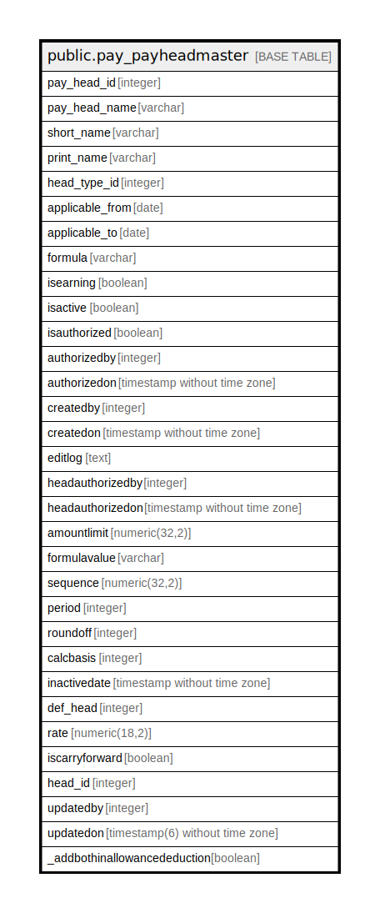

# public.pay_payheadmaster

## Description

## Columns

| Name | Type | Default | Nullable | Children | Parents | Comment |
| ---- | ---- | ------- | -------- | -------- | ------- | ------- |
| pay_head_id | integer | nextval('pay_payheadmaster_pay_head_id_seq'::regclass) | false |  |  |  |
| pay_head_name | varchar |  | true |  |  |  |
| short_name | varchar |  | true |  |  |  |
| print_name | varchar |  | true |  |  |  |
| head_type_id | integer |  | true |  |  |  |
| applicable_from | date |  | true |  |  |  |
| applicable_to | date |  | true |  |  |  |
| formula | varchar |  | true |  |  |  |
| isearning | boolean |  | true |  |  |  |
| isactive | boolean |  | true |  |  |  |
| isauthorized | boolean |  | true |  |  |  |
| authorizedby | integer |  | true |  |  |  |
| authorizedon | timestamp without time zone |  | true |  |  |  |
| createdby | integer |  | true |  |  |  |
| createdon | timestamp without time zone | now() | true |  |  |  |
| editlog | text |  | true |  |  |  |
| headauthorizedby | integer |  | true |  |  |  |
| headauthorizedon | timestamp without time zone |  | true |  |  |  |
| amountlimit | numeric(32,2) |  | true |  |  |  |
| formulavalue | varchar |  | true |  |  |  |
| sequence | numeric(32,2) |  | true |  |  |  |
| period | integer |  | true |  |  |  |
| roundoff | integer |  | true |  |  |  |
| calcbasis | integer |  | true |  |  |  |
| inactivedate | timestamp without time zone |  | true |  |  |  |
| def_head | integer |  | true |  |  |  |
| rate | numeric(18,2) |  | true |  |  |  |
| iscarryforward | boolean |  | true |  |  |  |
| head_id | integer |  | true |  |  |  |
| updatedby | integer |  | true |  |  |  |
| updatedon | timestamp(6) without time zone | NULL::timestamp without time zone | true |  |  |  |
| _addbothinallowancededuction | boolean | false | true |  |  |  |

## Constraints

| Name | Type | Definition |
| ---- | ---- | ---------- |
| pay_head_name | UNIQUE | UNIQUE (pay_head_name) |
| pay_payheadmaster_pkey | PRIMARY KEY | PRIMARY KEY (pay_head_id) |
| print_name | UNIQUE | UNIQUE (print_name) |
| sequence | UNIQUE | UNIQUE (sequence) |
| short_name | UNIQUE | UNIQUE (short_name) |

## Indexes

| Name | Definition |
| ---- | ---------- |
| pay_head_name | CREATE UNIQUE INDEX pay_head_name ON public.pay_payheadmaster USING btree (pay_head_name) |
| pay_payheadmaster_pkey | CREATE UNIQUE INDEX pay_payheadmaster_pkey ON public.pay_payheadmaster USING btree (pay_head_id) |
| print_name | CREATE UNIQUE INDEX print_name ON public.pay_payheadmaster USING btree (print_name) |
| sequence | CREATE UNIQUE INDEX sequence ON public.pay_payheadmaster USING btree (sequence) |
| short_name | CREATE UNIQUE INDEX short_name ON public.pay_payheadmaster USING btree (short_name) |

## Relations

---

> Generated by [tbls](https://github.com/k1LoW/tbls)
