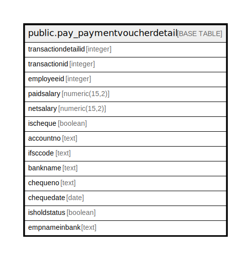

# public.pay_paymentvoucherdetail

## Description

## Columns

| Name | Type | Default | Nullable | Children | Parents | Comment |
| ---- | ---- | ------- | -------- | -------- | ------- | ------- |
| transactiondetailid | integer | nextval('pay_paymentvoucherdetail_transactiondetailid_seq'::regclass) | false |  |  |  |
| transactionid | integer |  | true |  |  |  |
| employeeid | integer |  | true |  |  |  |
| paidsalary | numeric(15,2) |  | true |  |  |  |
| netsalary | numeric(15,2) |  | true |  |  |  |
| ischeque | boolean | false | true |  |  |  |
| accountno | text |  | true |  |  |  |
| ifsccode | text |  | true |  |  |  |
| bankname | text |  | true |  |  |  |
| chequeno | text |  | true |  |  |  |
| chequedate | date |  | true |  |  |  |
| isholdstatus | boolean | false | true |  |  |  |
| empnameinbank | text |  | true |  |  |  |

## Relations

---

> Generated by [tbls](https://github.com/k1LoW/tbls)
