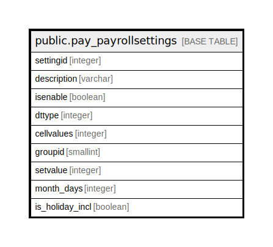

# public.pay_payrollsettings

## Description

## Columns

| Name | Type | Default | Nullable | Children | Parents | Comment |
| ---- | ---- | ------- | -------- | -------- | ------- | ------- |
| settingid | integer | nextval('pay_payrollsettings_settingid_seq'::regclass) | false |  |  |  |
| description | varchar |  | true |  |  |  |
| isenable | boolean |  | true |  |  |  |
| dttype | integer |  | true |  |  | 1=boolean,2=dtp,3=combo |
| cellvalues | integer |  | true |  |  |  |
| groupid | smallint |  | true |  |  |  |
| setvalue | integer |  | true |  |  |  |
| month_days | integer |  | true |  |  |  |
| is_holiday_incl | boolean |  | true |  |  |  |

## Constraints

| Name | Type | Definition |
| ---- | ---- | ---------- |
| pay_payrollsettings_pkey | PRIMARY KEY | PRIMARY KEY (settingid) |

## Indexes

| Name | Definition |
| ---- | ---------- |
| pay_payrollsettings_pkey | CREATE UNIQUE INDEX pay_payrollsettings_pkey ON public.pay_payrollsettings USING btree (settingid) |

## Relations

---

> Generated by [tbls](https://github.com/k1LoW/tbls)
