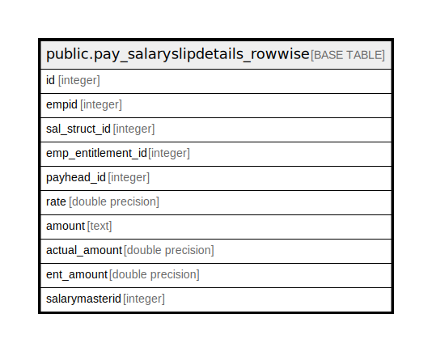

# public.pay_salaryslipdetails_rowwise

## Description

## Columns

| Name | Type | Default | Nullable | Children | Parents | Comment |
| ---- | ---- | ------- | -------- | -------- | ------- | ------- |
| id | integer | nextval('pay_salaryslipdetails_rowwise_id_seq'::regclass) | false |  |  |  |
| empid | integer |  | false |  |  |  |
| sal_struct_id | integer |  | false |  |  |  |
| emp_entitlement_id | integer |  | true |  |  |  |
| payhead_id | integer |  | false |  |  |  |
| rate | double precision |  | true |  |  |  |
| amount | text |  | true |  |  |  |
| actual_amount | double precision |  | true |  |  |  |
| ent_amount | double precision |  | true |  |  |  |
| salarymasterid | integer |  | true |  |  |  |

## Constraints

| Name | Type | Definition |
| ---- | ---- | ---------- |
| pay_salaryslipdetails_rowwise_pkey | PRIMARY KEY | PRIMARY KEY (id) |

## Indexes

| Name | Definition |
| ---- | ---------- |
| pay_salaryslipdetails_rowwise_pkey | CREATE UNIQUE INDEX pay_salaryslipdetails_rowwise_pkey ON public.pay_salaryslipdetails_rowwise USING btree (id) |

## Relations

---

> Generated by [tbls](https://github.com/k1LoW/tbls)
