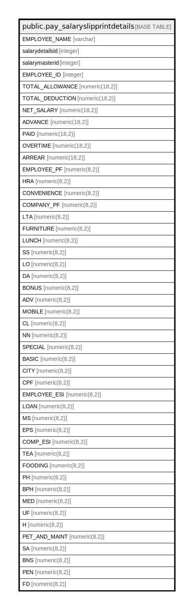

# public.pay_salaryslipprintdetails

## Description

## Columns

| Name | Type | Default | Nullable | Children | Parents | Comment |
| ---- | ---- | ------- | -------- | -------- | ------- | ------- |
| EMPLOYEE_NAME | varchar |  | true |  |  |  |
| salarydetailsid | integer |  | true |  |  |  |
| salarymasterid | integer |  | true |  |  |  |
| EMPLOYEE_ID | integer |  | true |  |  |  |
| TOTAL_ALLOWANCE | numeric(18,2) |  | true |  |  |  |
| TOTAL_DEDUCTION | numeric(18,2) |  | true |  |  |  |
| NET_SALARY | numeric(18,2) |  | true |  |  |  |
| ADVANCE | numeric(18,2) |  | true |  |  |  |
| PAID | numeric(18,2) |  | true |  |  |  |
| OVERTIME | numeric(18,2) |  | true |  |  |  |
| ARREAR | numeric(18,2) |  | true |  |  |  |
| EMPLOYEE_PF | numeric(8,2) |  | true |  |  |  |
| HRA | numeric(8,2) |  | true |  |  |  |
| CONVENIENCE | numeric(8,2) |  | true |  |  |  |
| COMPANY_PF | numeric(8,2) |  | true |  |  |  |
| LTA | numeric(8,2) |  | true |  |  |  |
| FURNITURE | numeric(8,2) |  | true |  |  |  |
| LUNCH | numeric(8,2) |  | true |  |  |  |
| SS | numeric(8,2) |  | true |  |  |  |
| LO | numeric(8,2) |  | true |  |  |  |
| DA | numeric(8,2) |  | true |  |  |  |
| BONUS | numeric(8,2) |  | true |  |  |  |
| ADV | numeric(8,2) |  | true |  |  |  |
| MOBILE | numeric(8,2) |  | true |  |  |  |
| CL | numeric(8,2) |  | true |  |  |  |
| NN | numeric(8,2) |  | true |  |  |  |
| SPECIAL | numeric(8,2) |  | true |  |  |  |
| BASIC | numeric(8,2) |  | true |  |  |  |
| CITY | numeric(8,2) |  | true |  |  |  |
| CPF | numeric(8,2) |  | true |  |  |  |
| EMPLOYEE_ESI | numeric(8,2) |  | true |  |  |  |
| LOAN | numeric(8,2) |  | true |  |  |  |
| MS | numeric(8,2) |  | true |  |  |  |
| EPS | numeric(8,2) |  | true |  |  |  |
| COMP_ESI | numeric(8,2) |  | true |  |  |  |
| TEA | numeric(8,2) |  | true |  |  |  |
| FOODING | numeric(8,2) |  | true |  |  |  |
| PH | numeric(8,2) |  | true |  |  |  |
| BPH | numeric(8,2) |  | true |  |  |  |
| MED | numeric(8,2) |  | true |  |  |  |
| UF | numeric(8,2) |  | true |  |  |  |
| H | numeric(8,2) |  | true |  |  |  |
| PET_AND_MAINT | numeric(8,2) |  | true |  |  |  |
| SA | numeric(8,2) |  | true |  |  |  |
| BNS | numeric(8,2) |  | true |  |  |  |
| PEN | numeric(8,2) |  | true |  |  |  |
| FD | numeric(8,2) |  | true |  |  |  |
| CONV | numeric(8,2) |  | true |  |  |  |
| ESI | numeric(8,2) |  | true |  |  |  |
| COMPESI | numeric(8,2) |  | true |  |  |  |
| EPF | numeric(8,2) |  | true |  |  |  |
| COMPEPF | numeric(8,2) |  | true |  |  |  |
| WALFARE_FUND | numeric(8,2) |  | true |  |  |  |
| BA | numeric(8,2) |  | true |  |  |  |

## Relations

---

> Generated by [tbls](https://github.com/k1LoW/tbls)
