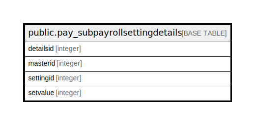

# public.pay_subpayrollsettingdetails

## Description

## Columns

| Name | Type | Default | Nullable | Children | Parents | Comment |
| ---- | ---- | ------- | -------- | -------- | ------- | ------- |
| detailsid | integer | nextval('pay_subpayrollsettingdetails_detailsid_seq'::regclass) | false |  |  |  |
| masterid | integer |  | true |  |  |  |
| settingid | integer |  | true |  |  |  |
| setvalue | integer |  | true |  |  |  |

## Constraints

| Name | Type | Definition |
| ---- | ---- | ---------- |
| pay_subpayrollsettingdetails_pkey | PRIMARY KEY | PRIMARY KEY (detailsid) |

## Indexes

| Name | Definition |
| ---- | ---------- |
| pay_subpayrollsettingdetails_pkey | CREATE UNIQUE INDEX pay_subpayrollsettingdetails_pkey ON public.pay_subpayrollsettingdetails USING btree (detailsid) |

## Relations

---

> Generated by [tbls](https://github.com/k1LoW/tbls)
