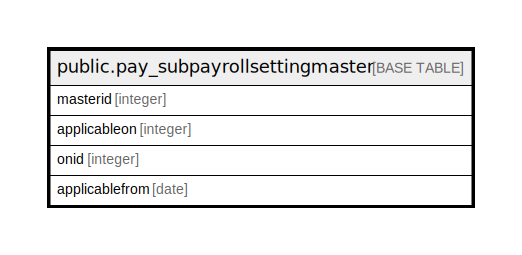

# public.pay_subpayrollsettingmaster

## Description

## Columns

| Name | Type | Default | Nullable | Children | Parents | Comment |
| ---- | ---- | ------- | -------- | -------- | ------- | ------- |
| masterid | integer | nextval('pay_subpayrollsettingmaster_masterid_seq'::regclass) | false |  |  |  |
| applicableon | integer |  | true |  |  | 1=branch,2=grade,3=employee |
| onid | integer |  | true |  |  | branch/grade/employee-id |
| applicablefrom | date |  | true |  |  |  |

## Constraints

| Name | Type | Definition |
| ---- | ---- | ---------- |
| pay_subpayrollsetting_pkey | PRIMARY KEY | PRIMARY KEY (masterid) |

## Indexes

| Name | Definition |
| ---- | ---------- |
| pay_subpayrollsetting_pkey | CREATE UNIQUE INDEX pay_subpayrollsetting_pkey ON public.pay_subpayrollsettingmaster USING btree (masterid) |

## Relations

---

> Generated by [tbls](https://github.com/k1LoW/tbls)
