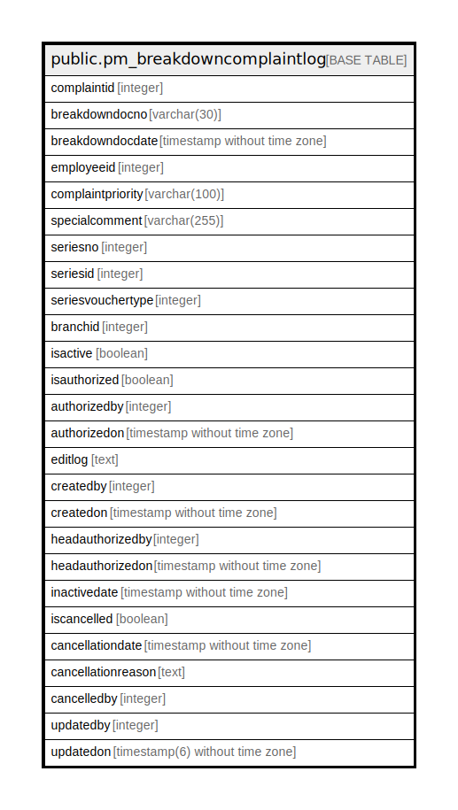

# public.pm_breakdowncomplaintlog

## Description

## Columns

| Name | Type | Default | Nullable | Children | Parents | Comment |
| ---- | ---- | ------- | -------- | -------- | ------- | ------- |
| complaintid | integer | nextval('pm_breakdowncomplaintlog_complaintid_seq'::regclass) | false |  |  |  |
| breakdowndocno | varchar(30) |  | true |  |  |  |
| breakdowndocdate | timestamp without time zone |  | true |  |  |  |
| employeeid | integer |  | false |  |  |  |
| complaintpriority | varchar(100) |  | true |  |  |  |
| specialcomment | varchar(255) |  | true |  |  |  |
| seriesno | integer |  | true |  |  |  |
| seriesid | integer |  | true |  |  |  |
| seriesvouchertype | integer |  | true |  |  |  |
| branchid | integer |  | true |  |  |  |
| isactive | boolean | false | false |  |  |  |
| isauthorized | boolean | false | false |  |  |  |
| authorizedby | integer |  | true |  |  |  |
| authorizedon | timestamp without time zone |  | true |  |  |  |
| editlog | text |  | true |  |  |  |
| createdby | integer |  | true |  |  |  |
| createdon | timestamp without time zone | now() | true |  |  |  |
| headauthorizedby | integer |  | true |  |  |  |
| headauthorizedon | timestamp without time zone |  | true |  |  |  |
| inactivedate | timestamp without time zone |  | true |  |  |  |
| iscancelled | boolean | false | true |  |  |  |
| cancellationdate | timestamp without time zone |  | true |  |  |  |
| cancellationreason | text |  | true |  |  |  |
| cancelledby | integer |  | true |  |  |  |
| updatedby | integer |  | true |  |  |  |
| updatedon | timestamp(6) without time zone | NULL::timestamp without time zone | true |  |  |  |

## Constraints

| Name | Type | Definition |
| ---- | ---- | ---------- |
| Unique_breakdowndocno_breakdowndocdate_branch | UNIQUE | UNIQUE (breakdowndocno, breakdowndocdate, branchid) |
| pm_breakdowncomplaintlog_pkey | PRIMARY KEY | PRIMARY KEY (complaintid) |

## Indexes

| Name | Definition |
| ---- | ---------- |
| Unique_breakdowndocno_breakdowndocdate_branch | CREATE UNIQUE INDEX "Unique_breakdowndocno_breakdowndocdate_branch" ON public.pm_breakdowncomplaintlog USING btree (breakdowndocno, breakdowndocdate, branchid) |
| pm_breakdowncomplaintlog_pkey | CREATE UNIQUE INDEX pm_breakdowncomplaintlog_pkey ON public.pm_breakdowncomplaintlog USING btree (complaintid) |

## Relations

---

> Generated by [tbls](https://github.com/k1LoW/tbls)
