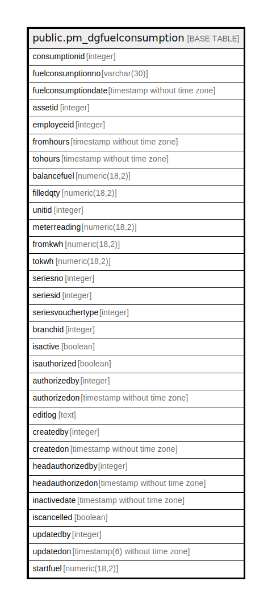

# public.pm_dgfuelconsumption

## Description

## Columns

| Name | Type | Default | Nullable | Children | Parents | Comment |
| ---- | ---- | ------- | -------- | -------- | ------- | ------- |
| consumptionid | integer | nextval('pm_dgfuelconsumption_consumptionid_seq'::regclass) | false |  |  |  |
| fuelconsumptionno | varchar(30) |  | true |  |  |  |
| fuelconsumptiondate | timestamp without time zone |  | true |  |  |  |
| assetid | integer |  | false |  |  |  |
| employeeid | integer |  | false |  |  |  |
| fromhours | timestamp without time zone |  | true |  |  |  |
| tohours | timestamp without time zone |  | true |  |  |  |
| balancefuel | numeric(18,2) |  | true |  |  |  |
| filledqty | numeric(18,2) |  | true |  |  |  |
| unitid | integer |  | true |  |  |  |
| meterreading | numeric(18,2) |  | true |  |  |  |
| fromkwh | numeric(18,2) |  | true |  |  |  |
| tokwh | numeric(18,2) |  | true |  |  |  |
| seriesno | integer |  | true |  |  |  |
| seriesid | integer |  | true |  |  |  |
| seriesvouchertype | integer |  | true |  |  |  |
| branchid | integer |  | true |  |  |  |
| isactive | boolean | false | false |  |  |  |
| isauthorized | boolean | false | false |  |  |  |
| authorizedby | integer |  | true |  |  |  |
| authorizedon | timestamp without time zone |  | true |  |  |  |
| editlog | text |  | true |  |  |  |
| createdby | integer |  | true |  |  |  |
| createdon | timestamp without time zone | now() | true |  |  |  |
| headauthorizedby | integer |  | true |  |  |  |
| headauthorizedon | timestamp without time zone |  | true |  |  |  |
| inactivedate | timestamp without time zone |  | true |  |  |  |
| iscancelled | boolean | false | true |  |  |  |
| updatedby | integer |  | true |  |  |  |
| updatedon | timestamp(6) without time zone | NULL::timestamp without time zone | true |  |  |  |
| startfuel | numeric(18,2) |  | true |  |  |  |

## Constraints

| Name | Type | Definition |
| ---- | ---- | ---------- |
| Unique_fuelconsumptionno_fuelconsumptiondate | UNIQUE | UNIQUE (fuelconsumptionno, fuelconsumptiondate) |
| pm_dgfuelconsumption_pkey | PRIMARY KEY | PRIMARY KEY (consumptionid) |

## Indexes

| Name | Definition |
| ---- | ---------- |
| Unique_fuelconsumptionno_fuelconsumptiondate | CREATE UNIQUE INDEX "Unique_fuelconsumptionno_fuelconsumptiondate" ON public.pm_dgfuelconsumption USING btree (fuelconsumptionno, fuelconsumptiondate) |
| pm_dgfuelconsumption_pkey | CREATE UNIQUE INDEX pm_dgfuelconsumption_pkey ON public.pm_dgfuelconsumption USING btree (consumptionid) |

## Relations

---

> Generated by [tbls](https://github.com/k1LoW/tbls)
