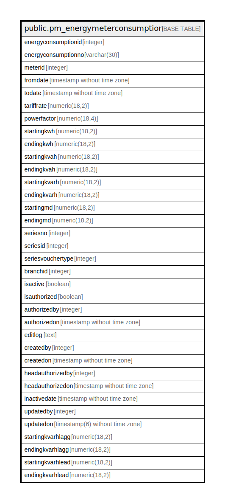

# public.pm_energymeterconsumption

## Description

## Columns

| Name | Type | Default | Nullable | Children | Parents | Comment |
| ---- | ---- | ------- | -------- | -------- | ------- | ------- |
| energyconsumptionid | integer | nextval('pm_energymeterconsumption_energyconsumptionid_seq'::regclass) | false |  |  |  |
| energyconsumptionno | varchar(30) |  | true |  |  |  |
| meterid | integer |  | false |  |  |  |
| fromdate | timestamp without time zone |  | true |  |  |  |
| todate | timestamp without time zone |  | true |  |  |  |
| tariffrate | numeric(18,2) |  | true |  |  |  |
| powerfactor | numeric(18,4) |  | true |  |  |  |
| startingkwh | numeric(18,2) |  | true |  |  |  |
| endingkwh | numeric(18,2) |  | true |  |  |  |
| startingkvah | numeric(18,2) |  | true |  |  |  |
| endingkvah | numeric(18,2) |  | true |  |  |  |
| startingkvarh | numeric(18,2) |  | true |  |  |  |
| endingkvarh | numeric(18,2) |  | true |  |  |  |
| startingmd | numeric(18,2) |  | true |  |  |  |
| endingmd | numeric(18,2) |  | true |  |  |  |
| seriesno | integer |  | true |  |  |  |
| seriesid | integer |  | true |  |  |  |
| seriesvouchertype | integer |  | true |  |  |  |
| branchid | integer |  | true |  |  |  |
| isactive | boolean | false | false |  |  |  |
| isauthorized | boolean | false | false |  |  |  |
| authorizedby | integer |  | true |  |  |  |
| authorizedon | timestamp without time zone |  | true |  |  |  |
| editlog | text |  | true |  |  |  |
| createdby | integer |  | true |  |  |  |
| createdon | timestamp without time zone | now() | true |  |  |  |
| headauthorizedby | integer |  | true |  |  |  |
| headauthorizedon | timestamp without time zone |  | true |  |  |  |
| inactivedate | timestamp without time zone |  | true |  |  |  |
| updatedby | integer |  | true |  |  |  |
| updatedon | timestamp(6) without time zone | NULL::timestamp without time zone | true |  |  |  |
| startingkvarhlagg | numeric(18,2) |  | true |  |  |  |
| endingkvarhlagg | numeric(18,2) |  | true |  |  |  |
| startingkvarhlead | numeric(18,2) |  | true |  |  |  |
| endingkvarhlead | numeric(18,2) |  | true |  |  |  |

## Constraints

| Name | Type | Definition |
| ---- | ---- | ---------- |
| pm_energymeterconsumption_pkey | PRIMARY KEY | PRIMARY KEY (energyconsumptionid) |

## Indexes

| Name | Definition |
| ---- | ---------- |
| pm_energymeterconsumption_pkey | CREATE UNIQUE INDEX pm_energymeterconsumption_pkey ON public.pm_energymeterconsumption USING btree (energyconsumptionid) |
| ui_energyconsumptionno_no | CREATE UNIQUE INDEX ui_energyconsumptionno_no ON public.pm_energymeterconsumption USING btree (branchid, energyconsumptionno) WHERE (energyconsumptionid > 0) |

## Relations

---

> Generated by [tbls](https://github.com/k1LoW/tbls)
