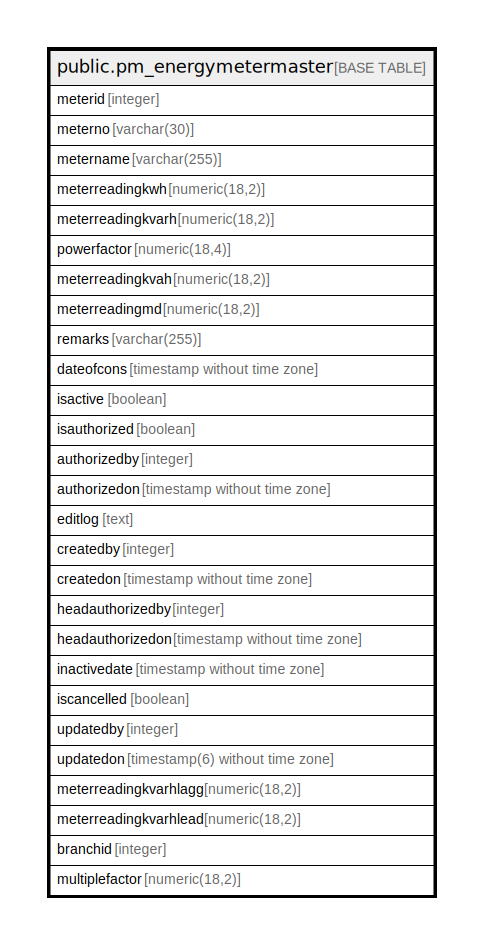

# public.pm_energymetermaster

## Description

## Columns

| Name | Type | Default | Nullable | Children | Parents | Comment |
| ---- | ---- | ------- | -------- | -------- | ------- | ------- |
| meterid | integer | nextval('pm_energymetermaster_meterid_seq'::regclass) | false |  |  |  |
| meterno | varchar(30) |  | false |  |  |  |
| metername | varchar(255) |  | true |  |  |  |
| meterreadingkwh | numeric(18,2) |  | true |  |  |  |
| meterreadingkvarh | numeric(18,2) |  | true |  |  |  |
| powerfactor | numeric(18,4) |  | true |  |  |  |
| meterreadingkvah | numeric(18,2) |  | true |  |  |  |
| meterreadingmd | numeric(18,2) |  | true |  |  |  |
| remarks | varchar(255) |  | true |  |  |  |
| dateofcons | timestamp without time zone |  | true |  |  |  |
| isactive | boolean | false | false |  |  |  |
| isauthorized | boolean | false | false |  |  |  |
| authorizedby | integer |  | true |  |  |  |
| authorizedon | timestamp without time zone |  | true |  |  |  |
| editlog | text |  | true |  |  |  |
| createdby | integer |  | true |  |  |  |
| createdon | timestamp without time zone | now() | true |  |  |  |
| headauthorizedby | integer |  | true |  |  |  |
| headauthorizedon | timestamp without time zone |  | true |  |  |  |
| inactivedate | timestamp without time zone |  | true |  |  |  |
| iscancelled | boolean | false | true |  |  |  |
| updatedby | integer |  | true |  |  |  |
| updatedon | timestamp(6) without time zone | NULL::timestamp without time zone | true |  |  |  |
| meterreadingkvarhlagg | numeric(18,2) |  | true |  |  |  |
| meterreadingkvarhlead | numeric(18,2) |  | true |  |  |  |
| branchid | integer |  | true |  |  |  |
| multiplefactor | numeric(18,2) |  | true |  |  |  |

## Constraints

| Name | Type | Definition |
| ---- | ---- | ---------- |
| Unique_meterno | UNIQUE | UNIQUE (meterno) |
| pm_metermaster_pkey | PRIMARY KEY | PRIMARY KEY (meterid) |

## Indexes

| Name | Definition |
| ---- | ---------- |
| Unique_meterno | CREATE UNIQUE INDEX "Unique_meterno" ON public.pm_energymetermaster USING btree (meterno) |
| pm_metermaster_pkey | CREATE UNIQUE INDEX pm_metermaster_pkey ON public.pm_energymetermaster USING btree (meterid) |

## Relations

---

> Generated by [tbls](https://github.com/k1LoW/tbls)
