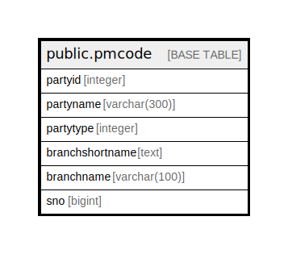

# public.pmcode

## Description

## Columns

| Name | Type | Default | Nullable | Children | Parents | Comment |
| ---- | ---- | ------- | -------- | -------- | ------- | ------- |
| partyid | integer |  | true |  |  |  |
| partyname | varchar(300) |  | true |  |  |  |
| partytype | integer |  | true |  |  |  |
| branchshortname | text |  | true |  |  |  |
| branchname | varchar(100) |  | true |  |  |  |
| sno | bigint |  | true |  |  |  |

## Relations

---

> Generated by [tbls](https://github.com/k1LoW/tbls)
