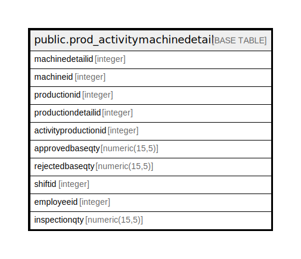

# public.prod_activitymachinedetail

## Description

## Columns

| Name | Type | Default | Nullable | Children | Parents | Comment |
| ---- | ---- | ------- | -------- | -------- | ------- | ------- |
| machinedetailid | integer | nextval('prod_activitymachinedetail_machinedetailid_seq'::regclass) | false |  |  |  |
| machineid | integer |  | true |  |  |  |
| productionid | integer |  | true |  |  |  |
| productiondetailid | integer |  | true |  |  |  |
| activityproductionid | integer |  | true |  |  |  |
| approvedbaseqty | numeric(15,5) |  | true |  |  |  |
| rejectedbaseqty | numeric(15,5) |  | true |  |  |  |
| shiftid | integer |  | true |  |  |  |
| employeeid | integer |  | true |  |  |  |
| inspectionqty | numeric(15,5) | 0 | true |  |  |  |

## Constraints

| Name | Type | Definition |
| ---- | ---- | ---------- |
| prod_activitymachinedetail_pkey | PRIMARY KEY | PRIMARY KEY (machinedetailid) |

## Indexes

| Name | Definition |
| ---- | ---------- |
| prod_activitymachinedetail_pkey | CREATE UNIQUE INDEX prod_activitymachinedetail_pkey ON public.prod_activitymachinedetail USING btree (machinedetailid) |

## Relations

---

> Generated by [tbls](https://github.com/k1LoW/tbls)
