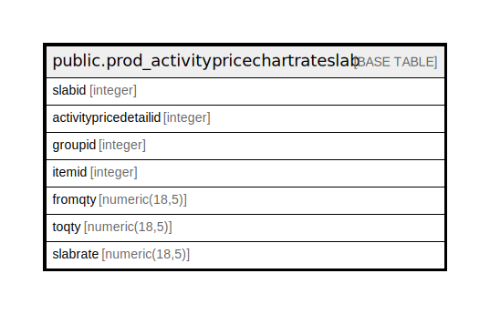

# public.prod_activitypricechartrateslab

## Description

## Columns

| Name | Type | Default | Nullable | Children | Parents | Comment |
| ---- | ---- | ------- | -------- | -------- | ------- | ------- |
| slabid | integer | nextval('prod_activitypricechartrateslab_slabid_seq'::regclass) | false |  |  |  |
| activitypricedetailid | integer |  | true |  |  |  |
| groupid | integer |  | true |  |  |  |
| itemid | integer |  | true |  |  |  |
| fromqty | numeric(18,5) |  | true |  |  |  |
| toqty | numeric(18,5) |  | true |  |  |  |
| slabrate | numeric(18,5) |  | true |  |  |  |

## Constraints

| Name | Type | Definition |
| ---- | ---- | ---------- |
| prod_activitypricechartrateslab_pkey | PRIMARY KEY | PRIMARY KEY (slabid) |

## Indexes

| Name | Definition |
| ---- | ---------- |
| prod_activitypricechartrateslab_pkey | CREATE UNIQUE INDEX prod_activitypricechartrateslab_pkey ON public.prod_activitypricechartrateslab USING btree (slabid) |

## Relations

---

> Generated by [tbls](https://github.com/k1LoW/tbls)
