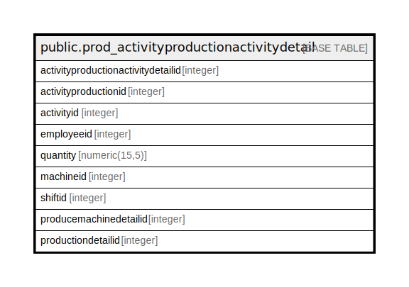

# public.prod_activityproductionactivitydetail

## Description

## Columns

| Name | Type | Default | Nullable | Children | Parents | Comment |
| ---- | ---- | ------- | -------- | -------- | ------- | ------- |
| activityproductionactivitydetailid | integer | nextval('prod_activityproductionactivi_activityproductionactivitydet_seq'::regclass) | false |  |  |  |
| activityproductionid | integer |  | true |  |  |  |
| activityid | integer |  | true |  |  |  |
| employeeid | integer |  | true |  |  |  |
| quantity | numeric(15,5) |  | true |  |  |  |
| machineid | integer |  | true |  |  |  |
| shiftid | integer |  | true |  |  |  |
| producemachinedetailid | integer |  | true |  |  |  |
| productiondetailid | integer |  | true |  |  |  |

## Constraints

| Name | Type | Definition |
| ---- | ---- | ---------- |
| prod_activityproductionactivitydetail_pkey | PRIMARY KEY | PRIMARY KEY (activityproductionactivitydetailid) |

## Indexes

| Name | Definition |
| ---- | ---------- |
| prod_activityproductionactivitydetail_pkey | CREATE UNIQUE INDEX prod_activityproductionactivitydetail_pkey ON public.prod_activityproductionactivitydetail USING btree (activityproductionactivitydetailid) |

## Relations

---

> Generated by [tbls](https://github.com/k1LoW/tbls)
