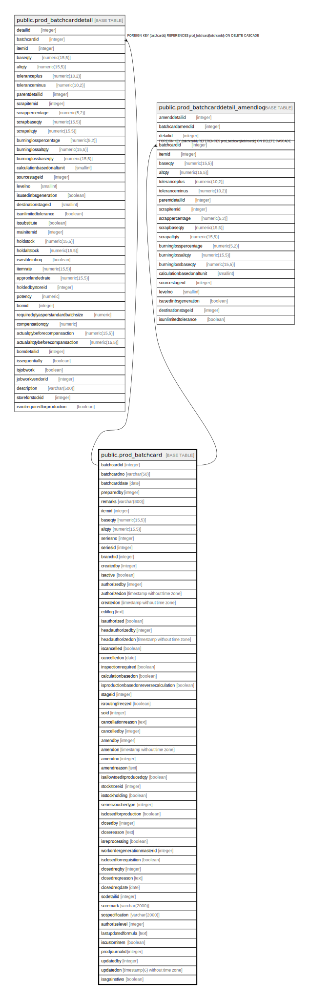

# public.prod_batchcard

## Description

## Columns

| Name | Type | Default | Nullable | Children | Parents | Comment |
| ---- | ---- | ------- | -------- | -------- | ------- | ------- |
| batchcardid | integer | nextval('prod_batchcard_batchcardid_seq'::regclass) | false | [public.prod_batchcarddetail](public.prod_batchcarddetail.md) [public.prod_batchcarddetail_amendlog](public.prod_batchcarddetail_amendlog.md) |  |  |
| batchcardno | varchar(50) |  | true |  |  |  |
| batchcarddate | date |  | true |  |  |  |
| preparedby | integer |  | true |  |  |  |
| remarks | varchar(800) |  | true |  |  |  |
| itemid | integer |  | true |  |  |  |
| baseqty | numeric(15,5) |  | true |  |  |  |
| altqty | numeric(15,5) |  | true |  |  |  |
| seriesno | integer |  | true |  |  |  |
| seriesid | integer |  | true |  |  |  |
| branchid | integer |  | true |  |  |  |
| createdby | integer |  | true |  |  |  |
| isactive | boolean | true | true |  |  |  |
| authorizedby | integer |  | true |  |  |  |
| authorizedon | timestamp without time zone |  | true |  |  |  |
| createdon | timestamp without time zone | now() | true |  |  |  |
| editlog | text |  | true |  |  |  |
| isauthorized | boolean | false | true |  |  |  |
| headauthorizedby | integer |  | true |  |  |  |
| headauthorizedon | timestamp without time zone |  | true |  |  |  |
| iscancelled | boolean | false | true |  |  |  |
| cancelledon | date |  | true |  |  |  |
| inspectionrequired | boolean | false | true |  |  |  |
| calculationbasedon | boolean | true | true |  |  |  |
| isproductionbasedonreversecalculation | boolean | false | true |  |  |  |
| stageid | integer |  | true |  |  |  |
| isroutingfreezed | boolean | false | true |  |  |  |
| soid | integer |  | true |  |  |  |
| cancellationreason | text |  | true |  |  |  |
| cancelledby | integer |  | true |  |  |  |
| isallowtoeditproducedqty | boolean | false | true |  |  |  |
| stockstoreid | integer |  | true |  |  |  |
| isstockholding | boolean | false | true |  |  |  |
| amendby | integer |  | true |  |  |  |
| amendon | timestamp without time zone |  | true |  |  |  |
| amendno | integer |  | true |  |  |  |
| amendreason | text |  | true |  |  |  |
| seriesvouchertype | integer |  | true |  |  |  |
| isclosedforproduction | boolean | false | true |  |  |  |
| closedby | integer |  | true |  |  |  |
| closereason | text |  | true |  |  |  |
| isreprocessing | boolean |  | true |  |  |  |
| workordergenerationmasterid | integer | 0 | false |  |  |  |
| isclosedforrequisition | boolean |  | true |  |  |  |
| closedreqby | integer |  | true |  |  |  |
| closedreqreason | text |  | true |  |  |  |
| closedreqdate | date |  | true |  |  |  |
| sodetailid | integer | 0 | true |  |  |  |
| soremark | varchar(2000) | ''::character varying | true |  |  |  |
| sospecification | varchar(2000) | ''::character varying | true |  |  |  |
| authorizelevel | integer | 0 | true |  |  |  |
| lastupdatedformula | text |  | true |  |  |  |
| iscustomitem | boolean | false | true |  |  |  |
| prodjournalid | integer |  | true |  |  |  |
| updatedby | integer |  | true |  |  |  |
| updatedon | timestamp(6) without time zone | NULL::timestamp without time zone | true |  |  |  |
| isagainstiwo | boolean | false | true |  |  |  |

## Constraints

| Name | Type | Definition |
| ---- | ---- | ---------- |
| prod_batchcard_pkey | PRIMARY KEY | PRIMARY KEY (batchcardid) |

## Indexes

| Name | Definition |
| ---- | ---------- |
| prod_batchcard_pkey | CREATE UNIQUE INDEX prod_batchcard_pkey ON public.prod_batchcard USING btree (batchcardid) |
| Index_BatchCard_Active | CREATE INDEX "Index_BatchCard_Active" ON public.prod_batchcard USING btree (batchcardid) WHERE ((NOT COALESCE(iscancelled, false)) AND (NOT COALESCE(isclosedforproduction, false)) AND isstockholding) |
| Index_BatchCard_Active2 | CREATE INDEX "Index_BatchCard_Active2" ON public.prod_batchcard USING btree (batchcardid, stockstoreid) WHERE ((NOT COALESCE(iscancelled, false)) AND (NOT COALESCE(isclosedforproduction, false)) AND isstockholding) |
| ui_batchcard_no | CREATE UNIQUE INDEX ui_batchcard_no ON public.prod_batchcard USING btree (branchid, batchcarddate, batchcardno, seriesvouchertype) WHERE (batchcardid > 0) |
| ui_key_batchcard | CREATE UNIQUE INDEX ui_key_batchcard ON public.prod_batchcard USING btree (batchcardno, batchcarddate, seriesno, branchid, seriesvouchertype) WHERE (batchcarddate > '2019-02-12'::date) |

## Triggers

| Name | Definition |
| ---- | ---------- |
| batchcard_amend_log_entry | CREATE TRIGGER batchcard_amend_log_entry BEFORE UPDATE ON public.prod_batchcard FOR EACH ROW EXECUTE FUNCTION batchcard_amend_log_entry() |

## Relations

---

> Generated by [tbls](https://github.com/k1LoW/tbls)
