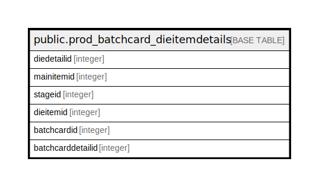

# public.prod_batchcard_dieitemdetails

## Description

## Columns

| Name | Type | Default | Nullable | Children | Parents | Comment |
| ---- | ---- | ------- | -------- | -------- | ------- | ------- |
| diedetailid | integer | nextval('prod_batchcard_dieitemdetails_diedetailid_seq'::regclass) | false |  |  |  |
| mainitemid | integer |  | true |  |  |  |
| stageid | integer |  | true |  |  |  |
| dieitemid | integer |  | true |  |  |  |
| batchcardid | integer |  | true |  |  |  |
| batchcarddetailid | integer |  | true |  |  |  |

## Relations

---

> Generated by [tbls](https://github.com/k1LoW/tbls)
