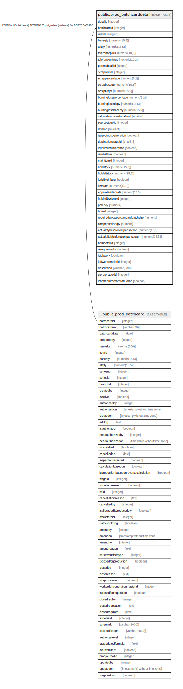

# public.prod_batchcarddetail

## Description

## Columns

| Name | Type | Default | Nullable | Children | Parents | Comment |
| ---- | ---- | ------- | -------- | -------- | ------- | ------- |
| detailid | integer | nextval('prod_batchcarddetail_detailid_seq'::regclass) | false |  |  |  |
| batchcardid | integer |  | true |  | [public.prod_batchcard](public.prod_batchcard.md) |  |
| itemid | integer |  | true |  |  |  |
| baseqty | numeric(15,5) |  | true |  |  |  |
| altqty | numeric(15,5) |  | true |  |  |  |
| toleranceplus | numeric(10,2) |  | true |  |  |  |
| toleranceminus | numeric(10,2) |  | true |  |  |  |
| parentdetailid | integer |  | true |  |  |  |
| scrapitemid | integer |  | true |  |  |  |
| scrappercentage | numeric(5,2) |  | true |  |  |  |
| scrapbaseqty | numeric(15,5) |  | true |  |  |  |
| scrapaltqty | numeric(15,5) |  | true |  |  |  |
| burninglosspercentage | numeric(5,2) |  | true |  |  |  |
| burninglossaltqty | numeric(15,5) |  | true |  |  |  |
| burninglossbaseqty | numeric(15,5) |  | true |  |  |  |
| calculationbasedonaltunit | smallint |  | true |  |  |  |
| sourcestageid | integer |  | true |  |  |  |
| levelno | smallint | 0 | true |  |  |  |
| isusedinbsgeneration | boolean | false | true |  |  | Used in production to produce serial or batch of produced item against the consumption |
| destinationstageid | smallint |  | true |  |  |  |
| isunlimitedtolerance | boolean | false | true |  |  |  |
| issubstitute | boolean | false | true |  |  |  |
| mainitemid | integer |  | true |  |  |  |
| holdstock | numeric(15,5) |  | true |  |  |  |
| holdaltstock | numeric(15,5) |  | true |  |  |  |
| isvisibleinboq | boolean | false | true |  |  |  |
| itemrate | numeric(15,5) |  | true |  |  |  |
| approxlandedrate | numeric(15,5) |  | true |  |  |  |
| holdedbystoreid | integer |  | true |  |  |  |
| potency | numeric |  | true |  |  |  |
| bomid | integer |  | true |  |  |  |
| requiredqtyasperstandardbatchsize | numeric |  | true |  |  |  |
| compensationqty | numeric |  | true |  |  |  |
| actualqtybeforecompansaction | numeric(15,5) |  | true |  |  |  |
| actualaltqtybeforecompansaction | numeric(15,5) |  | true |  |  |  |
| bomdetailid | integer |  | true |  |  |  |
| issequentially | boolean | false | true |  |  |  |
| isjobwork | boolean | false | true |  |  |  |
| jobworkvendorid | integer | 0 | true |  |  |  |
| description | varchar(500) | NULL::character varying | true |  |  |  |
| storeforstockid | integer |  | true |  |  |  |
| isnotrequiredforproduction | boolean | false | true |  |  |  |

## Constraints

| Name | Type | Definition |
| ---- | ---- | ---------- |
| fk | FOREIGN KEY | FOREIGN KEY (batchcardid) REFERENCES prod_batchcard(batchcardid) ON DELETE CASCADE |
| prod_batchcarddetail_pkey | PRIMARY KEY | PRIMARY KEY (detailid) |

## Indexes

| Name | Definition |
| ---- | ---------- |
| prod_batchcarddetail_pkey | CREATE UNIQUE INDEX prod_batchcarddetail_pkey ON public.prod_batchcarddetail USING btree (detailid) |
| Index_BC_Det_BCID | CREATE INDEX "Index_BC_Det_BCID" ON public.prod_batchcarddetail USING btree (batchcardid) |

## Triggers

| Name | Definition |
| ---- | ---------- |
| batchcard_amend_log_entry | CREATE TRIGGER batchcard_amend_log_entry BEFORE UPDATE ON public.prod_batchcarddetail FOR EACH ROW EXECUTE FUNCTION batchcard_amend_log_entry() |
| checkstock_onsaving | CREATE TRIGGER checkstock_onsaving BEFORE INSERT OR UPDATE ON public.prod_batchcarddetail FOR EACH ROW EXECUTE FUNCTION trg_checkstock() |

## Relations

---

> Generated by [tbls](https://github.com/k1LoW/tbls)
