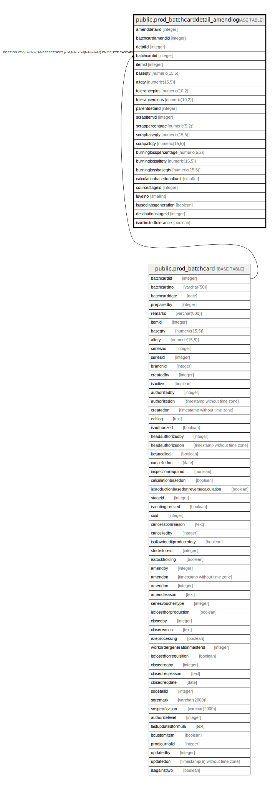

# public.prod_batchcarddetail_amendlog

## Description

## Columns

| Name | Type | Default | Nullable | Children | Parents | Comment |
| ---- | ---- | ------- | -------- | -------- | ------- | ------- |
| amenddetailid | integer | nextval('prod_batchcarddetail_amendlog_amenddetailid_seq'::regclass) | false |  |  |  |
| batchcardamendid | integer |  | true |  |  |  |
| detailid | integer |  | true |  |  |  |
| batchcardid | integer |  | true |  | [public.prod_batchcard](public.prod_batchcard.md) |  |
| itemid | integer |  | true |  |  |  |
| baseqty | numeric(15,5) |  | true |  |  |  |
| altqty | numeric(15,5) |  | true |  |  |  |
| toleranceplus | numeric(10,2) |  | true |  |  |  |
| toleranceminus | numeric(10,2) |  | true |  |  |  |
| parentdetailid | integer |  | true |  |  |  |
| scrapitemid | integer |  | true |  |  |  |
| scrappercentage | numeric(5,2) |  | true |  |  |  |
| scrapbaseqty | numeric(15,5) |  | true |  |  |  |
| scrapaltqty | numeric(15,5) |  | true |  |  |  |
| burninglosspercentage | numeric(5,2) |  | true |  |  |  |
| burninglossaltqty | numeric(15,5) |  | true |  |  |  |
| burninglossbaseqty | numeric(15,5) |  | true |  |  |  |
| calculationbasedonaltunit | smallint |  | true |  |  |  |
| sourcestageid | integer |  | true |  |  |  |
| levelno | smallint | 0 | true |  |  |  |
| isusedinbsgeneration | boolean | false | true |  |  |  |
| destinationstageid | integer |  | true |  |  |  |
| isunlimitedtolerance | boolean | false | true |  |  |  |

## Constraints

| Name | Type | Definition |
| ---- | ---- | ---------- |
| fk | FOREIGN KEY | FOREIGN KEY (batchcardid) REFERENCES prod_batchcard(batchcardid) ON DELETE CASCADE |
| prod_batchcarddetail_amendlog_pkey | PRIMARY KEY | PRIMARY KEY (amenddetailid) |

## Indexes

| Name | Definition |
| ---- | ---------- |
| prod_batchcarddetail_amendlog_pkey | CREATE UNIQUE INDEX prod_batchcarddetail_amendlog_pkey ON public.prod_batchcarddetail_amendlog USING btree (amenddetailid) |

## Relations

---

> Generated by [tbls](https://github.com/k1LoW/tbls)
