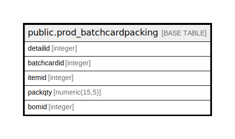

# public.prod_batchcardpacking

## Description

## Columns

| Name | Type | Default | Nullable | Children | Parents | Comment |
| ---- | ---- | ------- | -------- | -------- | ------- | ------- |
| detailid | integer | nextval('prod_batchcardpacking_detailid_seq'::regclass) | false |  |  |  |
| batchcardid | integer |  | false |  |  |  |
| itemid | integer |  | true |  |  |  |
| packqty | numeric(15,5) |  | true |  |  |  |
| bomid | integer |  | true |  |  |  |

## Constraints

| Name | Type | Definition |
| ---- | ---- | ---------- |
| prod_batchcardpacking_pkey | PRIMARY KEY | PRIMARY KEY (detailid) |

## Indexes

| Name | Definition |
| ---- | ---------- |
| prod_batchcardpacking_pkey | CREATE UNIQUE INDEX prod_batchcardpacking_pkey ON public.prod_batchcardpacking USING btree (detailid) |
| Index_BC_PacDet_BCID | CREATE INDEX "Index_BC_PacDet_BCID" ON public.prod_batchcardpacking USING btree (batchcardid) |

## Relations

---

> Generated by [tbls](https://github.com/k1LoW/tbls)
