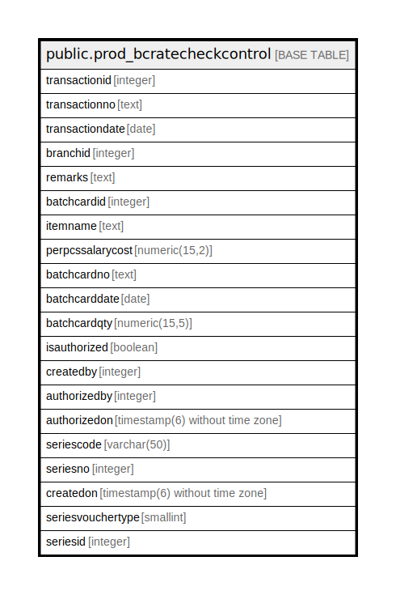

# public.prod_bcratecheckcontrol

## Description

## Columns

| Name | Type | Default | Nullable | Children | Parents | Comment |
| ---- | ---- | ------- | -------- | -------- | ------- | ------- |
| transactionid | integer | nextval('prod_bcratecheckcontrol_transactionid_seq'::regclass) | false |  |  |  |
| transactionno | text |  | true |  |  |  |
| transactiondate | date |  | true |  |  |  |
| branchid | integer |  | true |  |  |  |
| remarks | text |  | true |  |  |  |
| batchcardid | integer |  | true |  |  |  |
| itemname | text |  | true |  |  |  |
| perpcssalarycost | numeric(15,2) |  | true |  |  |  |
| batchcardno | text |  | true |  |  |  |
| batchcarddate | date |  | true |  |  |  |
| batchcardqty | numeric(15,5) |  | true |  |  |  |
| isauthorized | boolean | false | false |  |  |  |
| createdby | integer |  | false |  |  |  |
| authorizedby | integer |  | true |  |  |  |
| authorizedon | timestamp(6) without time zone |  | true |  |  |  |
| seriescode | varchar(50) |  | true |  |  |  |
| seriesno | integer |  | true |  |  |  |
| createdon | timestamp(6) without time zone | now() | true |  |  |  |
| seriesvouchertype | smallint | 0 | true |  |  |  |
| seriesid | integer |  | true |  |  |  |

## Relations

---

> Generated by [tbls](https://github.com/k1LoW/tbls)
