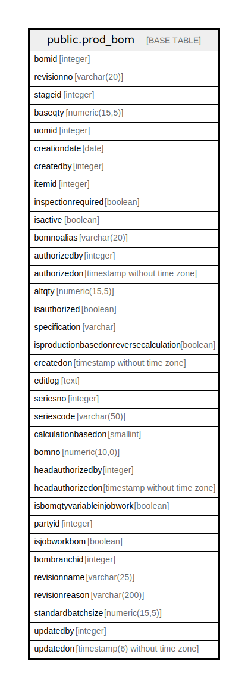

# public.prod_bom

## Description

## Columns

| Name | Type | Default | Nullable | Children | Parents | Comment |
| ---- | ---- | ------- | -------- | -------- | ------- | ------- |
| bomid | integer | nextval('prod_bom_bomid_seq'::regclass) | false |  |  |  |
| revisionno | varchar(20) |  | true |  |  |  |
| stageid | integer |  | true |  |  |  |
| baseqty | numeric(15,5) |  | true |  |  |  |
| uomid | integer |  | true |  |  |  |
| creationdate | date |  | true |  |  |  |
| createdby | integer |  | true |  |  |  |
| itemid | integer |  | true |  |  |  |
| inspectionrequired | boolean |  | true |  |  |  |
| isactive | boolean | false | true |  |  |  |
| bomnoalias | varchar(20) |  | false |  |  |  |
| authorizedby | integer |  | true |  |  |  |
| authorizedon | timestamp without time zone |  | true |  |  |  |
| altqty | numeric(15,5) |  | true |  |  |  |
| isauthorized | boolean | false | true |  |  |  |
| specification | varchar |  | true |  |  |  |
| isproductionbasedonreversecalculation | boolean | false | true |  |  |  |
| createdon | timestamp without time zone | now() | true |  |  |  |
| editlog | text |  | true |  |  |  |
| seriesno | integer |  | true |  |  |  |
| seriescode | varchar(50) |  | true |  |  |  |
| calculationbasedon | smallint | 0 | true |  |  | 0=base 1=alt |
| bomno | numeric(10,0) |  | true |  |  |  |
| headauthorizedby | integer |  | true |  |  |  |
| headauthorizedon | timestamp without time zone |  | true |  |  |  |
| isbomqtyvariableinjobwork | boolean | false | true |  |  | if true produceqty/receive will become zero in opening jobwork during saving data |
| partyid | integer | 0 | true |  |  |  |
| isjobworkbom | boolean | false | true |  |  |  |
| bombranchid | integer |  | true |  |  |  |
| revisionname | varchar(25) | ''::character varying | true |  |  |  |
| revisionreason | varchar(200) | ''::character varying | true |  |  |  |
| standardbatchsize | numeric(15,5) |  | true |  |  |  |
| updatedby | integer |  | true |  |  |  |
| updatedon | timestamp(6) without time zone | NULL::timestamp without time zone | true |  |  |  |

## Constraints

| Name | Type | Definition |
| ---- | ---- | ---------- |
| bom_pkey | PRIMARY KEY | PRIMARY KEY (bomid) |

## Indexes

| Name | Definition |
| ---- | ---------- |
| bom_pkey | CREATE UNIQUE INDEX bom_pkey ON public.prod_bom USING btree (bomid) |
| ui_bom_no | CREATE UNIQUE INDEX ui_bom_no ON public.prod_bom USING btree (bombranchid, bomno, revisionno, itemid, bomnoalias) WHERE (bomid > 0) |

## Relations

---

> Generated by [tbls](https://github.com/k1LoW/tbls)
