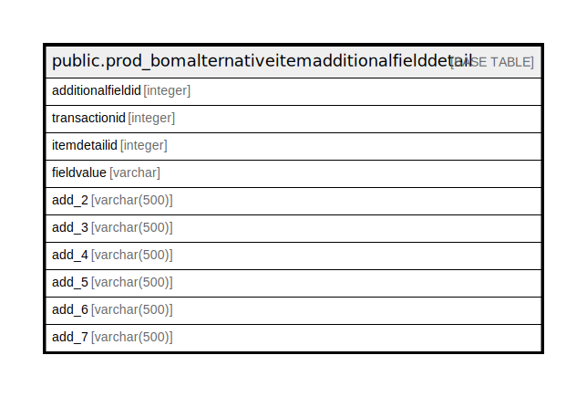

# public.prod_bomalternativeitemadditionalfielddetail

## Description

## Columns

| Name | Type | Default | Nullable | Children | Parents | Comment |
| ---- | ---- | ------- | -------- | -------- | ------- | ------- |
| additionalfieldid | integer | nextval('prod_bomalternativeitemadditionalfielddet_additionalfieldid_seq'::regclass) | false |  |  |  |
| transactionid | integer |  | false |  |  |  |
| itemdetailid | integer |  | false |  |  |  |
| fieldvalue | varchar |  | true |  |  |  |
| add_2 | varchar(500) | ''::character varying | true |  |  |  |
| add_3 | varchar(500) | ''::character varying | true |  |  |  |
| add_4 | varchar(500) | ''::character varying | true |  |  |  |
| add_5 | varchar(500) | ''::character varying | true |  |  |  |
| add_6 | varchar(500) | ''::character varying | true |  |  |  |
| add_7 | varchar(500) | ''::character varying | true |  |  |  |

## Constraints

| Name | Type | Definition |
| ---- | ---- | ---------- |
| prod_bomalternativeitemadditionalfielddetail_pkey | PRIMARY KEY | PRIMARY KEY (additionalfieldid) |

## Indexes

| Name | Definition |
| ---- | ---------- |
| prod_bomalternativeitemadditionalfielddetail_pkey | CREATE UNIQUE INDEX prod_bomalternativeitemadditionalfielddetail_pkey ON public.prod_bomalternativeitemadditionalfielddetail USING btree (additionalfieldid) |

## Relations

---

> Generated by [tbls](https://github.com/k1LoW/tbls)
