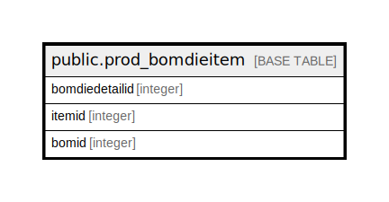

# public.prod_bomdieitem

## Description

## Columns

| Name | Type | Default | Nullable | Children | Parents | Comment |
| ---- | ---- | ------- | -------- | -------- | ------- | ------- |
| bomdiedetailid | integer | nextval('prod_bomdieitem_bomdiedetailid_seq'::regclass) | false |  |  |  |
| itemid | integer |  | true |  |  |  |
| bomid | integer |  | true |  |  |  |

## Relations

---

> Generated by [tbls](https://github.com/k1LoW/tbls)
