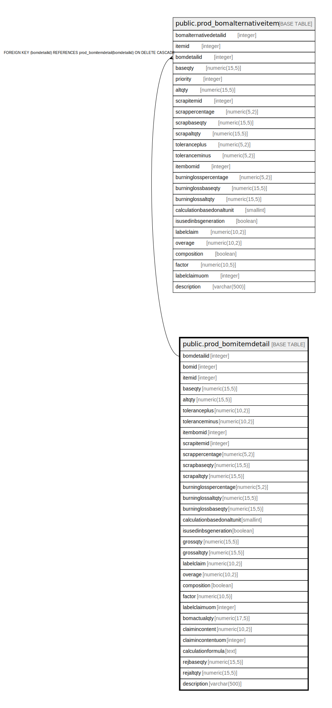

# public.prod_bomitemdetail

## Description

## Columns

| Name | Type | Default | Nullable | Children | Parents | Comment |
| ---- | ---- | ------- | -------- | -------- | ------- | ------- |
| bomdetailid | integer | nextval('prod_bomitemdetail_bomdetailid_seq'::regclass) | false | [public.prod_bomalternativeitem](public.prod_bomalternativeitem.md) |  |  |
| bomid | integer |  | true |  |  |  |
| itemid | integer |  | true |  |  |  |
| baseqty | numeric(15,5) |  | true |  |  |  |
| altqty | numeric(15,5) |  | true |  |  |  |
| toleranceplus | numeric(10,2) |  | true |  |  |  |
| toleranceminus | numeric(10,2) |  | true |  |  |  |
| itembomid | integer |  | true |  |  |  |
| scrapitemid | integer |  | true |  |  |  |
| scrappercentage | numeric(5,2) |  | true |  |  |  |
| scrapbaseqty | numeric(15,5) |  | true |  |  |  |
| scrapaltqty | numeric(15,5) |  | true |  |  |  |
| burninglosspercentage | numeric(5,2) |  | true |  |  |  |
| burninglossaltqty | numeric(15,5) |  | true |  |  |  |
| burninglossbaseqty | numeric(15,5) |  | true |  |  |  |
| calculationbasedonaltunit | smallint |  | true |  |  |  |
| isusedinbsgeneration | boolean | false | true |  |  | Used in production to produce serial or batch of produced item against the consumption |
| grossqty | numeric(15,5) | 0 | true |  |  |  |
| grossaltqty | numeric(15,5) | 0 | true |  |  |  |
| labelclaim | numeric(10,2) |  | true |  |  |  |
| overage | numeric(10,2) |  | true |  |  |  |
| composition | boolean | false | true |  |  |  |
| factor | numeric(10,5) |  | true |  |  |  |
| labelclaimuom | integer |  | true |  |  |  |
| bomactualqty | numeric(17,5) | 0 | false |  |  |  |
| claimincontent | numeric(10,2) | 0 | false |  |  |  |
| claimincontentuom | integer | 0 | false |  |  |  |
| calculationformula | text | ''::text | false |  |  |  |
| rejbaseqty | numeric(15,5) |  | true |  |  |  |
| rejaltqty | numeric(15,5) |  | true |  |  |  |
| description | varchar(500) | NULL::character varying | true |  |  |  |

## Constraints

| Name | Type | Definition |
| ---- | ---- | ---------- |
| bomitem_pkey | PRIMARY KEY | PRIMARY KEY (bomdetailid) |

## Indexes

| Name | Definition |
| ---- | ---------- |
| bomitem_pkey | CREATE UNIQUE INDEX bomitem_pkey ON public.prod_bomitemdetail USING btree (bomdetailid) |

## Relations

---

> Generated by [tbls](https://github.com/k1LoW/tbls)
