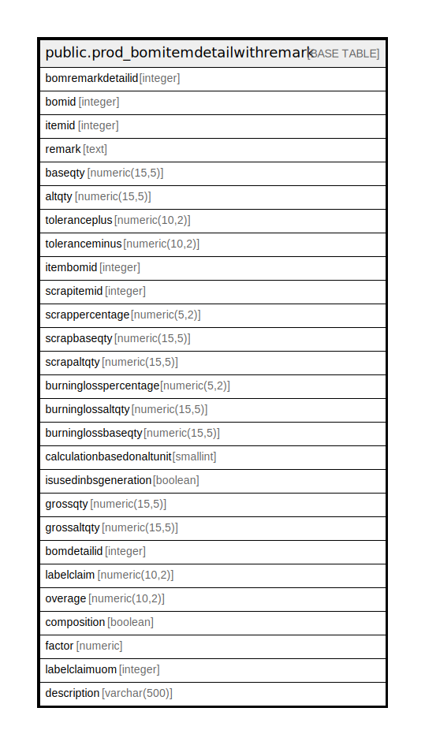

# public.prod_bomitemdetailwithremark

## Description

## Columns

| Name | Type | Default | Nullable | Children | Parents | Comment |
| ---- | ---- | ------- | -------- | -------- | ------- | ------- |
| bomremarkdetailid | integer | nextval('prod_bomitemdetailwithremark_bomremarkdetailid_seq'::regclass) | false |  |  |  |
| bomid | integer |  | true |  |  |  |
| itemid | integer |  | true |  |  |  |
| remark | text |  | true |  |  |  |
| baseqty | numeric(15,5) |  | true |  |  |  |
| altqty | numeric(15,5) |  | true |  |  |  |
| toleranceplus | numeric(10,2) |  | true |  |  |  |
| toleranceminus | numeric(10,2) |  | true |  |  |  |
| itembomid | integer |  | true |  |  |  |
| scrapitemid | integer |  | true |  |  |  |
| scrappercentage | numeric(5,2) |  | true |  |  |  |
| scrapbaseqty | numeric(15,5) |  | true |  |  |  |
| scrapaltqty | numeric(15,5) |  | true |  |  |  |
| burninglosspercentage | numeric(5,2) |  | true |  |  |  |
| burninglossaltqty | numeric(15,5) |  | true |  |  |  |
| burninglossbaseqty | numeric(15,5) |  | true |  |  |  |
| calculationbasedonaltunit | smallint |  | true |  |  |  |
| isusedinbsgeneration | boolean | false | true |  |  | Used in production to produce serial or batch of produced item against the consumption |
| grossqty | numeric(15,5) | 0 | true |  |  |  |
| grossaltqty | numeric(15,5) | 0 | true |  |  |  |
| bomdetailid | integer |  | true |  |  |  |
| labelclaim | numeric(10,2) |  | true |  |  |  |
| overage | numeric(10,2) |  | true |  |  |  |
| composition | boolean |  | true |  |  |  |
| factor | numeric |  | true |  |  |  |
| labelclaimuom | integer |  | true |  |  |  |
| description | varchar(500) | NULL::character varying | true |  |  |  |

## Constraints

| Name | Type | Definition |
| ---- | ---- | ---------- |
| bomitemwithremark_pkey | PRIMARY KEY | PRIMARY KEY (bomremarkdetailid) |

## Indexes

| Name | Definition |
| ---- | ---------- |
| bomitemwithremark_pkey | CREATE UNIQUE INDEX bomitemwithremark_pkey ON public.prod_bomitemdetailwithremark USING btree (bomremarkdetailid) |

## Relations

---

> Generated by [tbls](https://github.com/k1LoW/tbls)
