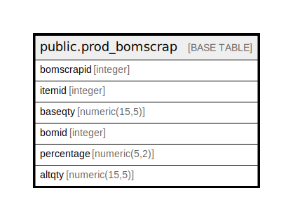

# public.prod_bomscrap

## Description

## Columns

| Name | Type | Default | Nullable | Children | Parents | Comment |
| ---- | ---- | ------- | -------- | -------- | ------- | ------- |
| bomscrapid | integer | nextval('prod_bomscrap_bomscrapid_seq'::regclass) | false |  |  |  |
| itemid | integer |  | true |  |  |  |
| baseqty | numeric(15,5) |  | true |  |  |  |
| bomid | integer |  | true |  |  |  |
| percentage | numeric(5,2) |  | true |  |  |  |
| altqty | numeric(15,5) |  | true |  |  |  |

## Constraints

| Name | Type | Definition |
| ---- | ---- | ---------- |
| bomscrap_pkey | PRIMARY KEY | PRIMARY KEY (bomscrapid) |

## Indexes

| Name | Definition |
| ---- | ---------- |
| bomscrap_pkey | CREATE UNIQUE INDEX bomscrap_pkey ON public.prod_bomscrap USING btree (bomscrapid) |

## Relations

---

> Generated by [tbls](https://github.com/k1LoW/tbls)
