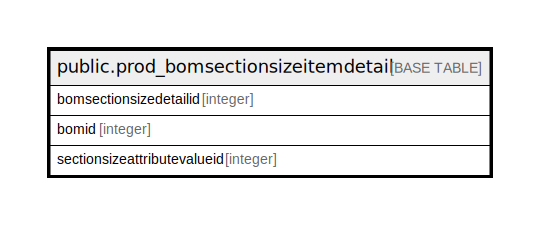

# public.prod_bomsectionsizeitemdetail

## Description

## Columns

| Name | Type | Default | Nullable | Children | Parents | Comment |
| ---- | ---- | ------- | -------- | -------- | ------- | ------- |
| bomsectionsizedetailid | integer | nextval('prod_bomsectionsizeitemdetail_bomsectionsizedetailid_seq'::regclass) | false |  |  |  |
| bomid | integer |  | true |  |  |  |
| sectionsizeattributevalueid | integer |  | true |  |  |  |

## Constraints

| Name | Type | Definition |
| ---- | ---- | ---------- |
| prod_bomsectionsizeitemdetail_pkey | PRIMARY KEY | PRIMARY KEY (bomsectionsizedetailid) |

## Indexes

| Name | Definition |
| ---- | ---------- |
| prod_bomsectionsizeitemdetail_pkey | CREATE UNIQUE INDEX prod_bomsectionsizeitemdetail_pkey ON public.prod_bomsectionsizeitemdetail USING btree (bomsectionsizedetailid) |

## Relations

---

> Generated by [tbls](https://github.com/k1LoW/tbls)
