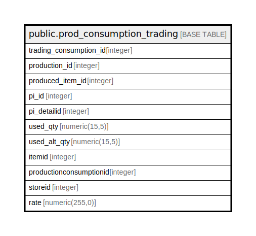

# public.prod_consumption_trading

## Description

## Columns

| Name | Type | Default | Nullable | Children | Parents | Comment |
| ---- | ---- | ------- | -------- | -------- | ------- | ------- |
| trading_consumption_id | integer | nextval('prod_consumption_trading_trading_consumption_id_seq'::regclass) | false |  |  |  |
| production_id | integer |  | false |  |  |  |
| produced_item_id | integer |  | false |  |  |  |
| pi_id | integer |  | false |  |  |  |
| pi_detailid | integer |  | false |  |  |  |
| used_qty | numeric(15,5) | NULL::numeric | false |  |  |  |
| used_alt_qty | numeric(15,5) | NULL::numeric | true |  |  |  |
| itemid | integer |  | true |  |  |  |
| productionconsumptionid | integer |  | true |  |  |  |
| storeid | integer |  | true |  |  |  |
| rate | numeric(255,0) |  | true |  |  |  |

## Constraints

| Name | Type | Definition |
| ---- | ---- | ---------- |
| prod_consumption_trading_pkey | PRIMARY KEY | PRIMARY KEY (trading_consumption_id) |

## Indexes

| Name | Definition |
| ---- | ---------- |
| prod_consumption_trading_pkey | CREATE UNIQUE INDEX prod_consumption_trading_pkey ON public.prod_consumption_trading USING btree (trading_consumption_id) |

## Relations

---

> Generated by [tbls](https://github.com/k1LoW/tbls)
