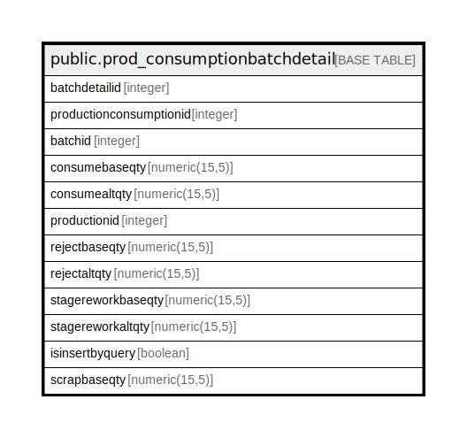

# public.prod_consumptionbatchdetail

## Description

## Columns

| Name | Type | Default | Nullable | Children | Parents | Comment |
| ---- | ---- | ------- | -------- | -------- | ------- | ------- |
| batchdetailid | integer | nextval('prod_consumptionbatchdetail_batchdetailid_seq'::regclass) | false |  |  |  |
| productionconsumptionid | integer |  | true |  |  |  |
| batchid | integer |  | true |  |  |  |
| consumebaseqty | numeric(15,5) |  | true |  |  |  |
| consumealtqty | numeric(15,5) |  | true |  |  |  |
| productionid | integer |  | true |  |  |  |
| rejectbaseqty | numeric(15,5) |  | true |  |  |  |
| rejectaltqty | numeric(15,5) |  | true |  |  |  |
| stagereworkbaseqty | numeric(15,5) |  | true |  |  |  |
| stagereworkaltqty | numeric(15,5) |  | true |  |  |  |
| scrapbaseqty | numeric(15,5) |  | true |  |  |  |

## Constraints

| Name | Type | Definition |
| ---- | ---- | ---------- |
| prod_consumptionbatchdetail_pkey | PRIMARY KEY | PRIMARY KEY (batchdetailid) |

## Indexes

| Name | Definition |
| ---- | ---------- |
| prod_consumptionbatchdetail_pkey | CREATE UNIQUE INDEX prod_consumptionbatchdetail_pkey ON public.prod_consumptionbatchdetail USING btree (batchdetailid) |
| Index_PE_ConsBatDet_ConDetID | CREATE INDEX "Index_PE_ConsBatDet_ConDetID" ON public.prod_consumptionbatchdetail USING btree (productionconsumptionid) |
| Index_PE_ConsBatDet_PEIDConDetID | CREATE INDEX "Index_PE_ConsBatDet_PEIDConDetID" ON public.prod_consumptionbatchdetail USING btree (productionid, productionconsumptionid) |

## Triggers

| Name | Definition |
| ---- | ---------- |
| prod_consumptionbatchdetail_trg_checkstock | CREATE TRIGGER prod_consumptionbatchdetail_trg_checkstock BEFORE INSERT OR UPDATE ON public.prod_consumptionbatchdetail FOR EACH ROW EXECUTE FUNCTION trg_checkstock() |

## Relations

---

> Generated by [tbls](https://github.com/k1LoW/tbls)
