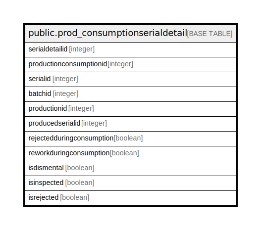

# public.prod_consumptionserialdetail

## Description

## Columns

| Name | Type | Default | Nullable | Children | Parents | Comment |
| ---- | ---- | ------- | -------- | -------- | ------- | ------- |
| serialdetailid | integer | nextval('prod_consumptionserialdetail_serialdetailid_seq'::regclass) | false |  |  |  |
| productionconsumptionid | integer |  | true |  |  |  |
| serialid | integer |  | true |  |  |  |
| batchid | integer |  | true |  |  |  |
| productionid | integer |  | true |  |  |  |
| producedserialid | integer |  | true |  |  |  |
| rejectedduringconsumption | boolean | false | true |  |  |  |
| reworkduringconsumption | boolean | false | true |  |  |  |
| isdismental | boolean | false | true |  |  |  |
| isinspected | boolean |  | true |  |  |  |
| isrejected | boolean |  | true |  |  |  |

## Constraints

| Name | Type | Definition |
| ---- | ---- | ---------- |
| prod_consumptionserialdetail_pkey | PRIMARY KEY | PRIMARY KEY (serialdetailid) |

## Indexes

| Name | Definition |
| ---- | ---------- |
| prod_consumptionserialdetail_pkey | CREATE UNIQUE INDEX prod_consumptionserialdetail_pkey ON public.prod_consumptionserialdetail USING btree (serialdetailid) |
| Index_PE_ConsSerDet_ConDetID | CREATE INDEX "Index_PE_ConsSerDet_ConDetID" ON public.prod_consumptionserialdetail USING btree (productionconsumptionid) |
| Index_PE_ConsSerDet_PEIDConDetID | CREATE INDEX "Index_PE_ConsSerDet_PEIDConDetID" ON public.prod_consumptionserialdetail USING btree (productionid, productionconsumptionid) |

## Triggers

| Name | Definition |
| ---- | ---------- |
| consumeserial_trg_check | CREATE TRIGGER consumeserial_trg_check BEFORE INSERT ON public.prod_consumptionserialdetail FOR EACH ROW EXECUTE FUNCTION trg_checkstock() |
| serialhistorydata | CREATE TRIGGER serialhistorydata BEFORE INSERT ON public.prod_consumptionserialdetail FOR EACH ROW EXECUTE FUNCTION tgr_serialhistory() |

## Relations

---

> Generated by [tbls](https://github.com/k1LoW/tbls)
