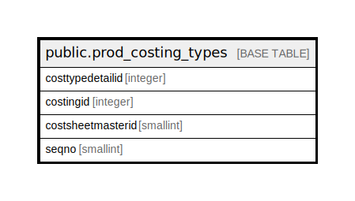

# public.prod_costing_types

## Description

## Columns

| Name | Type | Default | Nullable | Children | Parents | Comment |
| ---- | ---- | ------- | -------- | -------- | ------- | ------- |
| costtypedetailid | integer | nextval('prod_costing_types_costtypedetailid_seq'::regclass) | false |  |  |  |
| costingid | integer |  | false |  |  |  |
| costsheetmasterid | smallint |  | false |  |  |  |
| seqno | smallint |  | true |  |  |  |

## Constraints

| Name | Type | Definition |
| ---- | ---- | ---------- |
| prod_costing_types_pkey | PRIMARY KEY | PRIMARY KEY (costtypedetailid) |

## Indexes

| Name | Definition |
| ---- | ---------- |
| prod_costing_types_pkey | CREATE UNIQUE INDEX prod_costing_types_pkey ON public.prod_costing_types USING btree (costtypedetailid) |

## Relations

---

> Generated by [tbls](https://github.com/k1LoW/tbls)
