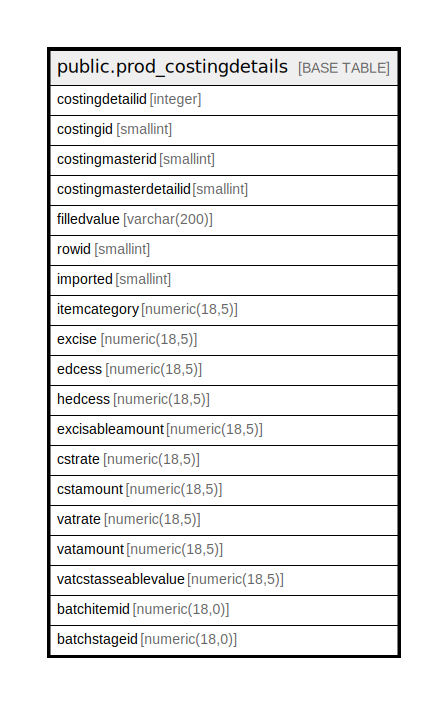

# public.prod_costingdetails

## Description

## Columns

| Name | Type | Default | Nullable | Children | Parents | Comment |
| ---- | ---- | ------- | -------- | -------- | ------- | ------- |
| costingdetailid | integer | nextval('prod_costingdetails_costingdetailid_seq'::regclass) | false |  |  |  |
| costingid | smallint |  | false |  |  |  |
| costingmasterid | smallint |  | false |  |  |  |
| costingmasterdetailid | smallint |  | true |  |  |  |
| filledvalue | varchar(200) |  | true |  |  |  |
| rowid | smallint |  | true |  |  |  |
| imported | smallint | 0 | true |  |  |  |
| itemcategory | numeric(18,5) | 0 | true |  |  |  |
| excise | numeric(18,5) |  | true |  |  |  |
| edcess | numeric(18,5) |  | true |  |  |  |
| hedcess | numeric(18,5) |  | true |  |  |  |
| excisableamount | numeric(18,5) |  | true |  |  |  |
| cstrate | numeric(18,5) |  | true |  |  |  |
| cstamount | numeric(18,5) |  | true |  |  |  |
| vatrate | numeric(18,5) |  | true |  |  |  |
| vatamount | numeric(18,5) |  | true |  |  |  |
| vatcstasseablevalue | numeric(18,5) |  | true |  |  |  |
| batchitemid | numeric(18,0) |  | true |  |  |  |
| batchstageid | numeric(18,0) |  | true |  |  |  |

## Constraints

| Name | Type | Definition |
| ---- | ---- | ---------- |
| prod_costingdetails_pkey | PRIMARY KEY | PRIMARY KEY (costingdetailid) |

## Indexes

| Name | Definition |
| ---- | ---------- |
| prod_costingdetails_pkey | CREATE UNIQUE INDEX prod_costingdetails_pkey ON public.prod_costingdetails USING btree (costingdetailid) |

## Triggers

| Name | Definition |
| ---- | ---------- |
| costing_amend_log_entry | CREATE TRIGGER costing_amend_log_entry AFTER INSERT OR UPDATE ON public.prod_costingdetails FOR EACH ROW EXECUTE FUNCTION costing_amend_log_entry() |

## Relations

---

> Generated by [tbls](https://github.com/k1LoW/tbls)
